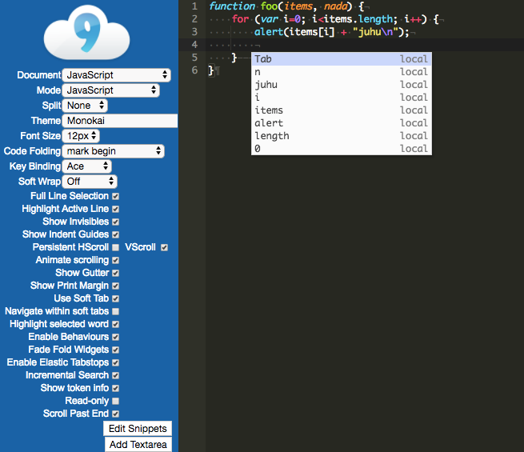

# 前言

由于在开发前端组件编辑工具中需要一款可以嵌入web的代码编辑器，所以对目前的开源的基于javascript的代码编辑器进行了调研。本文主要从编辑器的维护和更新状态、功能完备度、扩展性、外观/交互、官网/文档/api/demo、支持/维护/社区、兼容性(浏览器)等方面进行对比筛选。

# 编辑器统计数据

统计来源： 
<https://en.wikipedia.org/wiki/Comparison_of_JavaScript-based_source_code_editors>  
总览：

上表中主要从最后的版本发布时间，活跃状况来判断编辑器的维护和更新状态，同时判断是否开源也是选型的前提之一。
功能列表：

功能列表可以一目了然的把编辑器的功能完备度对比出来，作为现代的代码编辑器，语法主题高亮，自动补全缩进，快捷键操作，搜索和替换等功能是必不可少的。
综合上述两个表的数据，结合部分编辑器的官网介绍和demo，筛选出三款编辑器：ACE, codemirror, monaco editor，进行更细致全面的比较。

# codemirror

CodeMirror是一个用JavaScript为浏览器实现的多功能文本编辑器。它专门用于编辑代码，并附带一些实现更高级编辑功能的语言模式和插件。其核心仅提供编辑器功能，其他功能通过丰富的API和插件实现。CodeMirror的使用基于特定的程序语言模式(mode)，它对特定的语言进行语法解析(parse)，使编辑器能够在解析结果基础上进行语法高亮，实现具有上下文感知(context-aware)的代码补全、缩进等功能。


## 使用

引入codemirror.js/codemirror.css/ 对应语言的mode文件(如: /mode/javascript/javascript.js );
整体功能及扩展：

创建编辑器实例：

1.  编辑器将append到 container元素中：

```js
var editor = CodeMirror(container, options);
```

2.  或者直接替换textarea元素：

```js
var editor = CodeMirror.fromTextArea(myTextArea);
```

## 配置

默认配置从CodeMirror.defaults中获取。可以更新此对象以更改页面上的默认值，例如配置 输入初始值，语法模式，风格主题，键盘映射，快捷键绑定。

## event(事件)

各种与CodeMirror相关的对象发出事件，这些事件允许客户端代码对各种情况作出反应。
事件的处理程序可以用事件触发对象的on和off方法进行注册，主要由四类事件：编辑器实例、文档实例、代码行、文本范围。

## keymap(键盘映射)

键映射是将键和鼠标按钮与功能相关联的方式.键映射是一个映射字符串的对象，它将按钮标识为实现其功能的函数。带有Emacs，Vim和Sublime Text-style键盘映射。可以使用extraKey配置或command API自定义。

## command(命令)

命令是可以在编辑器上执行的无参数操作。他们主要用于键绑定。库本身定义了许多常用命令，其中大多数命令由默认的键绑定使用
定义命令：CodeMirror.commands，执行命令：execCommand。

## 自定义样式

CodeMirror的外观可以通过修改css文件实现。mode提供的css文件只是为该模式提供颜色。编辑器本身的样式通过改变或覆盖 codemirror.css的实现codemirror提供了必须定义的css类名，css文件必须包括这些类名才能保证编辑器的正常工作，主题也是css文件，定义了各种语法元素的颜色 查看 /theme 目录。

## API

许多CodeMirror功能只能通过其API访问。因此，如果您想将其公开给用户，则需要编写代码（或使用插件）。包括内容操作，光标和选择，配置，文件管理等方法。每个编辑器都与其文档CodeMirror.Doc的一个实例相关联，一个文档代表编辑器的内容，外加一个选择，一个撤消历史和一个模式，一个文档一次只能与一个编辑器关联，文档实例拥有历史操作、文本标记、工具、大小，滚动和定位、模式，状态和令牌相关的方法。

## addon(插件)

插件目录包含许多可重用的组件，这些组件实现了额外的编辑器功能，例如代码提示，代码补全，搜索和替换

## 编写mode

mode最简单的定义了一个词法解析器，解析编辑器的内容，更高级的模式也可以处理语言的缩进。(相当于写一个语法解析器，比较复杂，不具体描述)

## 功能表

| 功能             | 说明                                |
| ---------------- | ----------------------------------- |
| 语言             | 110+ mode                           |
| 可组合的mode系统 | option: parserfile(HTML mixed mode) |
| 自动完成         | addon/hint，支持上下文感知          |
| 代码折叠         | addon/fold                          |
| 快捷键配置       | option: extraKeys                   |
| 编辑器绑定       | option: keyMap                      |
| 搜索与替换       | addon/search                        |
| 自动补全         | addon/edit                          |
| 多视图           | editor.swapDoc()                    |
| 代码检查         | 引入JSLINT+addon/lint               |
| 字体样式混入     | css class                           |
| 多主题           | theme                               |
| 自动调整宽高     | option: viewportMargin              |
| 行内/块级        | editor.addLineWidget                |
| 断点             | option: gutter                      |
| 标记文本范围     | editor.markText()                   |
| 文本方向         | option: direction                   |
| 丰富的API和插件  | ...                                 |

codemirror通过插件实现了一些特别的功能，例如：

| 功能                                           | 说明                                        |
| ---------------------------------------------- | ------------------------------------------- |
| 添加widget                                     | <http://codemirror.net/demo/widget.html>    |
| 视图与代码的分离 Multiple Buffer & Split View  | <http://codemirror.net/demo/buffers.html>   |
| 代码的多路复用 Multiplexing Parser             | <http://codemirror.net/demo/multiplex.html> |
| 基于Tern(高级javascript解析引擎)的高级智能功能 | <http://codemirror.net/demo/tern.html>      |

## 评价
**优点：**
1.  功能总体完备
2.  扩展性高
3.  官网文档介绍详细，demo覆盖较全，插件也很多
4.  有专门的社区，管理维护较为活跃

**缺点：**
1.  功能需要配置和引入文件才能实现，功能多的时候需要引入的文件过多，不好管理。
2.  部分外观和交互基础显示不好，要通过自定义比较麻烦
3.  进行扩展需要一定的学习

## 附录
-   官网：<http://codemirror.net/>
-   github: <https://github.com/codemirror/CodeMirror/>
-   外部插件: <https://github.com/codemirror/CodeMirror/wiki/CodeMirror-addons>
-   编写mode: <http://codemirror.net/doc/manual.html#modeapi>
-   demo: <http://codemirror.net/demo/>
-   论坛：<https://discuss.codemirror.net/>
-   用户(Adobe Brackets,Chrome DevTools,Firefox Developer Tools): <http://codemirror.net/doc/realworld.html>

# ACE
Ace是一个用JavaScript编写的嵌入式代码编辑器。它与Sublime，Vim和TextMate等原生编辑器的功能和性能相匹配。它可以很容易地嵌入到任何网页和JavaScript应用程序中。作为与codemirror同类的现代编辑器，ACE同样拥有mode进行语法解析，实现编辑器的智能感知型功能。
  
Ace也实现了编辑器和代码文档的分离，Session管理代码的编辑状态，Document为代码容器，TextMode提供语言解析，为代码高亮和智能编辑提供支持，Editor为编辑器的核心，它处理代码的状态，处理IO事件，渲染编辑器组件。

## 使用

```js
<script type="text/javascript" src="https://cdn.jsdelivr.net/ace/1.2.3/noconflict/ace.js"></script>
<script type="text/javascript" src="https://cdn.jsdelivr.net/ace/1.2.3/noconflict/theme-clouds.js"></script>
<script type="text/javascript" src="https://cdn.jsdelivr.net/ace/1.2.3/noconflict/mode-less.js"></script>
<div id="editor"></div>
<script type="text/javascript">
  var editor = ace.edit("editor");
  editor.setTheme("ace/theme/clouds");
  editor.getSession().setMode("ace/mode/less");
  editor.setShowFoldWidgets(false);
</script>
```

通过ace.edit直接创建，通过api设置编辑器
  
Ace只需引入一个文件，跟codemirror的核心包差不多大小(400k左右)，但已经集成了丰富的特性，包括主题设置，语言设置，编辑内容和状态的操作，搜索替换，事件监听处理，快捷键与命令等功能。

## API

Ace主要分为Editor、Session、Document、Mode、VirtualRenderer五个模块，针对五个模块都有对应的API进行操作。通常用户使用较多的是Session类的API，涉及对编辑状态的获取和修改，如光标、选择、代码行、代码搜索等类的API方法都较为丰富。

## 自定义Mode
Ace提供了非常详细完整的文档描述如何自定义一个语法高亮的模块扩展，其中包括编写mode(语法解析)、高亮规则、代码流的状态机、mode继承等，并提供了一个可在线预览的编辑环境。

## 评价
**优点：**
1.  功能完备且集成度高
2.  支持的语言丰富
3.  支持在线编写mode和配置demo

**缺点：**
1.  扩展支持能力较为一般
2.  官方demo不支持源码预览

## 附录

-   官网： <https://ace.c9.io/>
-   github: <https://github.com/ajaxorg/ace>
-   编写mode: <https://ace.c9.io/tool/mode_creator.html>
-   demo: <https://ace.c9.io/build/kitchen-sink.html>
-   社区：<https://groups.google.com/forum/#!forum/ace-discuss>
-   用户: <https://ace.c9.io/#nav=production>

# monaco editor

monaco是VSCode的代码编辑器，同时也是一个开源代码编辑器，可以嵌入到Web应用程序中。


## 使用

```html
<!DOCTYPE html>
<html>
<head>
    <meta http-equiv="X-UA-Compatible" content="IE=edge" />
    <meta http-equiv="Content-Type" content="text/html;charset=utf-8" >
</head>
<body>

<div id="container" style="width:800px;height:600px;border:1px solid grey"></div>

<script src="monaco-editor/min/vs/loader.js"></script>
<script>
    require.config({ paths: { 'vs': 'monaco-editor/min/vs' }});
    require(['vs/editor/editor.main'], function() {
        var editor = monaco.editor.create(document.getElementById('container'), {
            value: [
                'function x() {',
                '\tconsole.log("Hello world!");',
                '}'
            ].join('\n'),
            language: 'javascript'
        });
    });
</script>
</body>
</html>
```

monaco的引入需要预先加载loader，该loader相当于一个AMD的加载器把monaco的模块和依赖加载进来，然后通过全局的monaco变量创建编辑器实例。这种引入方法对于打包可能会造成不小的麻烦，
社区也有issue(<https://github.com/Microsoft/monaco-editor/issues/18> )关于如何解决monaco在webpack中的加载。

## API

monaco实现了vscode的编辑器，功能完备且集成度高，可以说即插即用，非常适合仅需编辑功能不考虑扩展和自定义样式的场景。


API主要分为editor和language，涉及编辑器的操作使用editor提供的API，language主要进行代码程序语言的扩展。

## 自定义语法

monaco有一个专门的库Monarch定义语法高亮，包括language(语言定义)，token(语法标记)，state(状态机)，rules(输入规则)等语言解析的模块，其中可以通过json文件直接定义语言，不用像另外两种编辑器那样编写程序。同样也支持语法的继承。支持高级功能如复杂的大括号匹配，语言定义的更多属性，复杂的动态结束标签。与Ace一样提供在线的语法定义的编辑预览。


## 评价
**优点：**

1.  集成vscode的编辑功能，使用较为简单
2.  使用vscode的外观和交互较为友好
3.  原生支持代码diff，typescript

**缺点：**
1.  支持语言种类和主题较少
2.  扩展性较差
3.  独立的引入方式不适合打包
4.  不支持移动浏览器或移动Web框架

# 总结
功能点的对比

| 功能点             | ACE                   | CodeMirror                        | Monaco            |
| ------------------ | --------------------- | --------------------------------- | ----------------- |
| 代码着色/高亮      | √                     | √                                 | √                 |
| 主题               | √ (内置20+/可扩展)    | √ (内置40+)                       | 2种，即vs/vs dark |
| 语言支持           | √ (110+/可扩展)       | √ (130+)                          | √ (30+)           |
| 代码提示/自动补全  | √ (引入tool文件+配置) | √ 引入hint相关文件+配置快捷键命令 | √ 默认开启        |
| 代码完成/循环结构  | √                     | √                                 | √                 |
| 代码段             | √                     | √                                 | √                 |
| 搜索和替换         | √                     | √                                 | √                 |
| 多光标操作         | √                     | √                                 | √                 |
| 自动缩进           | √                     | √                                 | √                 |
| 代码折行           | √                     | √                                 | √                 |
| undo/redo          | √                     | √                                 | √                 |
| 快捷键             | √                     | √                                 | √                 |
| 代码检查lint       | √                     | √                                 |                   |
| 字符集支持         | √                     | √                                 |                   |
| 行数显示           | √                     | √                                 | √                 |
| 代码对比diff       |                       | √                                 | √                 |
| mixed mode混合模式 |                       | √                                 |                   |
| keymap键盘映射     | √  vim and Emacs      | √ (Vim, Emacs ,and Sublime Text ) |                   |
| 多视图             |                       | √                                 |                   |
| resize自适应       | √                     | √                                 |                   |
| 扩展小部件         |                       | √                                 |                   |
| 文本标记扩展       |                       | √                                 |                   |
| 命令行扩展         | √                     |                                   |                   |
| 鼠标拖放扩展       | √                     |                                   |                   |

功能的整体对比来看，CodeMirror的功能比较多，但三者相差不大，基本功能都具备，只是某些特殊功能codemirror可以通过其丰富的扩展实现。
综合对比：


| 特性      | CodeMirror                           | Ace                  | monaco                         |
| --------- | ------------------------------------ | -------------------- | ------------------------------ |
| 功能      | 完备                                 | 完备                 | 完备                           |
| 扩展性    | 插件、主题、mode扩展                 | 插件、主题、mode扩展 | mode扩展                       |
| 外观/交互 | 支持多款主题和部件<br>基础UI较为简单 | 支持多款主题         | vscode风格<br>风格统一交互友好 |

综合以上对比，可以对三款编辑器做出初步评价，三款功能基本完备，CodeMirror适合支持扩展性要求高的定制型编辑器，但其多文件的引入方式带来一定的管理不方便以及浏览器端的网络性能影响。Ace综合能力突出，适应现代的前端开发能力，基本上手简单，扩展也较为丰富，适合在浏览器端的网页中嵌入。monaco集成度最高，引入文件量巨大，引入方式兼容性不太好，但功能实现完备，不需另外的扩展引入，适合需要实现复杂功能但不进行深度扩展的应用，因其不支持mobile且文件量大，在electron这类的客户端环境使用较为合适。

# 附：

三款编辑器的vue组件封装和扩展：  
codemirror：

-   [Vue-Codemirror: Codemirror component for Vue.](https://github.com/surmon-china/vue-codemirror)
-   [Vue-Codemirror-Lite: Lightweight Codemirror Component for Vue.js](https://github.com/cnu4/vue-codemirror-lite)

monaco：

-   [vue-monaco-editor: Monaco Editor Vue Component](https://github.com/matt-oconnell/vue-monaco-editor)
-   [monaco-vue: Vue language plugin for the Monaco Editor.](https://github.com/rebornix/monaco-vue/blob/master/test/index.html)

Ace：

-   [vue2-ace-editor:A packaging of ace](https://github.com/chairuosen/vue2-ace-editor)
