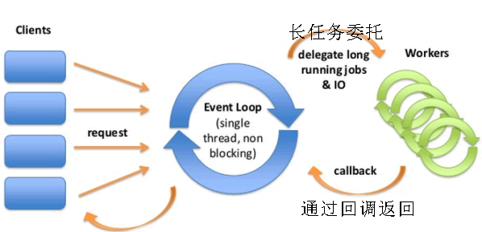
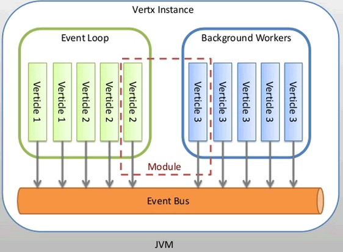
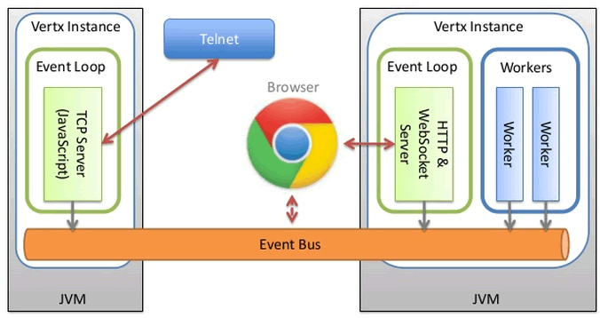
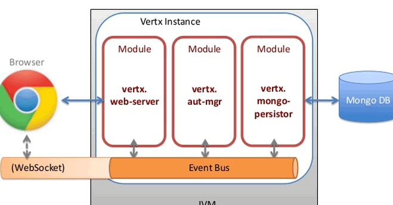
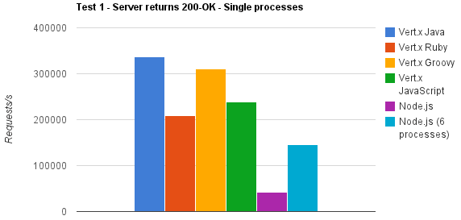

# 前言

Vert.x是什么？Vert.x的官方解释：

> Vert.x is a tool-kit for building reactive applications on the JVM.

Vert.x是一个在JVM上构建响应式应用的工具集，
这个定义比较模糊，我们来简单解释一下：**工具集**意味着Vert.x非常轻量，可以嵌入到你当前的应用中而不需要改变现有的结构；另一个重要的描述是**响应式**：Vert.x就是为构建响应式应用（系统）而设计的。响应式系统这个概念在 Reactive Manifesto 中有详细的定义。我们在这里总结4个要点：

-   响应式的(Responsive)：一个响应式系统需要在合理的时间内处理请求。
-   弹性的(Resilient)：一个响应式系统必须在遇到 异常（崩溃，超时， 500 错误等等）的时候保持响应的能力，所以它必须要为 异常处理 而设计。
-   可伸缩的(Elastic)：一个响应式系统必须在不同的负载情况下都要保持响应能力，所以它必须能伸能缩，并且可以利用最少的资源来处理负载。
-   消息驱动：一个响应式系统的各个组件之间通过异步消息传递来进行交互。

Vert.x是 事件驱动的，同时也是非阻塞的。首先，我们来介绍 Event Loop 的概念。Event Loop是一组负责分发和处理事件的线程。注意，我们绝对不能去阻塞Event Loop线程，否则事件的处理过程会被阻塞，我们的应用就失去了响应能力。因此当我们在写Vert.x应用的时候，我们要时刻谨记**异步非阻塞开发模式**而不是传统的阻塞开发模式。

基于Vert.x可开发各种移动，Web和企业应用程序。Vert.x一个主要特点是可使用多种语言编写应用，如Java, JavaScript, CoffeeScript, Ruby, Python , kotlin或 Groovy等等，它的简单actor-like机制能帮助脱离直接基于多线程编程。它是基于Netty和Java 7的NIO2的编写的。  
当前业界遭遇C10K问题，当并发连接超过10,000+以上时使用传统技术会引发暂停，移动设备或视频、声音如类似微信这样的实时聊天，都是属于长任务连接Long-lived。  
通常Tomcat会在100个并发长请求(这个请求要求做很多事长任务)下堵塞，而Vertx将长任务委托给另外一个线程来执行，从而不会堵塞当前线程，与NodeJS的原理非常类似，如下图：


事件循环的线程和长任务工作线程之间是通过事件总线EventBus通讯的，这个事件总线是一个JVM之中，如下图：


图中每个Verticle是一个线程，符合单写原则，避免了写争夺。总线可以拓展到客户端边的Javascript，可以在客户端和服务器端分发事件，可以如下图在多个客户端或服务器端：


下图是在一个Web应用中，多层之间也可以通过EventBus通讯实现调用：


Vert.x与NodeJS比较  


# 开始使用

首先新建一个Maven项目，一个基本的Maven项目目录结构如下所示：

```bash
├── pom.xml
├── src
│   ├── main
│   │   ├── java
│   │   └── resources
│   └── test
│       └── java
```

随后在pom.xml中加入相关的依赖和插件，如下所示：

```xml
<?xml version="1.0" encoding="UTF-8"?>
<project xmlns="http://maven.apache.org/POM/4.0.0"
         xmlns:xsi="http://www.w3.org/2001/XMLSchema-instance"
         xsi:schemaLocation="http://maven.apache.org/POM/4.0.0 http://maven.apache.org/xsd/maven-4.0.0.xsd">
    <modelVersion>4.0.0</modelVersion>

    <groupId>io.example</groupId>
    <artifactId>vertx-example</artifactId>
    <version>1.0-SNAPSHOT</version>

    <properties>
        <vertx.version>3.8.3</vertx.version>
        <main.class>io.example.Main</main.class>
    </properties>

    <dependencies>
        <dependency>
            <groupId>io.vertx</groupId>
            <artifactId>vertx-core</artifactId>
            <version>${vertx.version}</version>
        </dependency>
    </dependencies>

    <build>
        <plugins>
            <plugin>
                <artifactId>maven-compiler-plugin</artifactId>
                <version>3.3</version>
                <configuration>
                    <source>1.8</source>
                    <target>1.8</target>
                </configuration>
            </plugin>

            <plugin>
                <groupId>org.apache.maven.plugins</groupId>
                <artifactId>maven-shade-plugin</artifactId>
                <version>2.4.2</version>
                <executions>
                    <execution>
                        <phase>package</phase>
                        <goals>
                            <goal>shade</goal>
                        </goals>
                        <configuration>
                            <transformers>
                                <transformer implementation="org.apache.maven.plugins.shade.resource.ManifestResourceTransformer">
                                    <manifestEntries>
                                        <Main-Class>${main.class}</Main-Class>
                                    </manifestEntries>
                                </transformer>
                            </transformers>
                            <artifactSet />
                            <outputFile>${project.build.directory}/${project.artifactId}-${project.version}-prod.jar</outputFile>
                        </configuration>
                    </execution>
                </executions>
            </plugin>
        </plugins>
    </build>
</project>
```

然后我们在src/main/java/io/example目录下新建两个java文件，分别是Main.java和MyFirstVerticle.java，代码如下：
**Main.java**

```java
package io.example;

import io.vertx.core.Vertx;

/**
 * Created by hezhiyong on 2019/11/15.
 */
public class Main {
    public static void main(String[] args){
        Vertx vertx = Vertx.vertx();

        vertx.deployVerticle(MyFirstVerticle.class.getName());
    }
}
```

**MyFirstVerticle.java**

```java
package io.example;

import io.vertx.core.AbstractVerticle;
import io.vertx.ext.web.Router;

/**
 * Created by hezhiyong on 2019/11/15.
 */
public class MyFirstVerticle extends AbstractVerticle {
    @Override
    public void start() {
        Router router = Router.router(vertx);

        router.route("/").handler(routingContext -> {
            routingContext.response().putHeader("content-type", "text/html").end("Hello World!");
        });

        vertx.createHttpServer().requestHandler(router).listen(8080);
    }
}
```

使用eclipse或idea启动main方法，随后打开浏览器，在浏览器的地址栏中输入：<http://localhost:8080/> 便可看到熟悉的Hello World!

# Vert.x JDBC Client

## 添加依赖

要使用Vert.x JDBC Client，需要添加下面的依赖：

```xml
<dependency>
  <groupId>io.vertx</groupId>
  <artifactId>vertx-jdbc-client</artifactId>
  <version>3.8.3</version>
</dependency>
```

## 创建 Vert.x JDBC Client 对象

### 默认使用共享的数据源

大部分情况下，我们希望在不同的 Vert.x JDBC Client 对象之间，共享一个数据源。

```java
// Create a JDBC client with a test database
JDBCClient client = JDBCClient.createShared(vertx, new JsonObject()
        .put("url", "jdbc:hsqldb:mem:test?shutdown=true")
        .put("driver_class", "org.hsqldb.jdbcDriver"));
```

### 创建不共享数据源的Vert.x JDBC Client对象

在大部分情况下，我们会希望在不同的 Vert.x JDBC Client 对象之间共享数据源。但有时候，却恰恰相反。
这时，可以调用 JDBCClient.createNonShared 方法：

```java
// Create a JDBC client with a test database
JDBCClient client = JDBCClient.createNonShared(vertx, new JsonObject()
        .put("url", "jdbc:hsqldb:mem:test?shutdown=true")
        .put("driver_class", "org.hsqldb.jdbcDriver"));
```

每次调用此方法，就相当于在调用 JDBCClient.createShared 方法时加上了具有唯一名称的数据源参数。

## 获取数据库连接

在创建 Vert.x JDBC Client 对象后，我们可以通过getConnection方法来获取一个数据库连接。  
此方法从连接池中获取一个数据库连接，并返回给回调方法：

```java
client.getConnection(res -> {
  if (res.succeeded()) {

    SQLConnection connection = res.result();

    connection.query("SELECT * FROM some_table", res2 -> {
      if (res2.succeeded()) {

        ResultSet rs = res2.result();
        // 用结果集results进行其他操作
      }
    });
  } else {
    // 获取连接失败 - 处理失败的情况
  }
});
```

## 替换连接池

Vert.x默认连接池为C3P0
