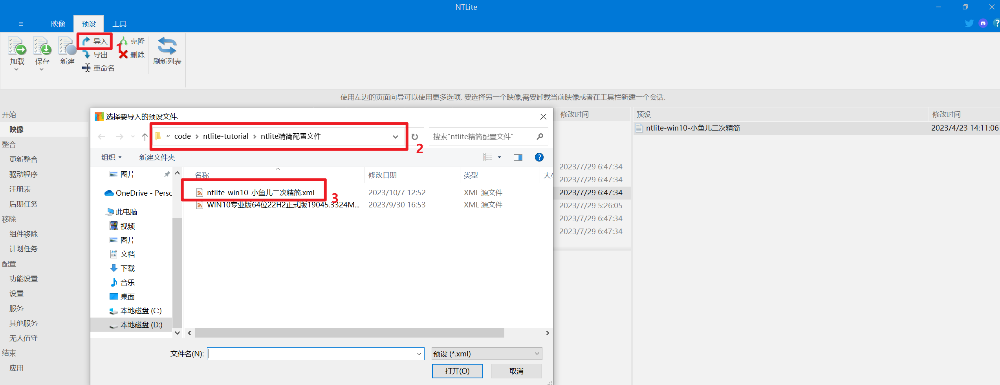
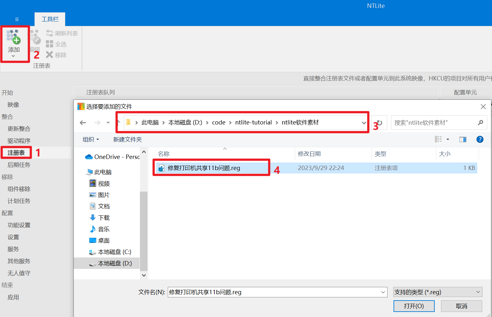

# 母盘制作

## 用到的软件
* 系统精简工具
  * [ntlite 官方最新版本](https://www.ntlite.com/download/)
* [windows10原版镜像](https://www.yrxitong.com/h-col-130.html)
* [修复打印机共享11b问题（注册表reg文件）](ntlite软件素材/修复打印机共享11b问题.reg)
* [小鱼儿适度精简母盘NTLite付费版配置文件（xml文件）](ntlite精简配置文件/WIN10专业版64位22H2正式版19045.3324MSDN8月适度精简母盘（2023-08-18）NTLite配置文件.xml)
  * 绝大部分不用组件(组件列表过多，不一一列举)；
  * 禁用系统保留空间；
  * 勾选SMB 1.0/CIFS File Sharing Support，以保证Windows XP可以正常访问Windows 10的共享文件和打印机；
  * 禁用SysMain服务（超级预读服务很占内存，并且对固态硬盘几乎是负优化，如果你使用的是固态硬盘那么建议禁用）；
* [ntlite-win10-小鱼儿二次精简.xml](ntlite精简配置文件/ntlite-win10-小鱼儿二次精简.xml)

## 母盘制作过程
* 解压镜像zh-cn_windows_10_business_editions_version_22h2_updated_aug_2023_x64_dvd_291a0e4c.iso得到zh-cn_windows_10_business_editions_version_22h2_updated_aug_2023_x64_dvd_291a0e4c文件夹；

* 拷贝zh-cn_windows_10_business_editions_version_22h2_updated_aug_2023_x64_dvd_291a0e4c/sources/install.wim系统映像文件至其他目录，并重命名为zh-cn_windows_10_business_editions_version_22h2_updated_aug_2023_x64_dvd_291a0e4c.wim；

* 打开ntlite选择zh-cn_windows_10_business_editions_version_22h2_updated_aug_2023_x64_dvd_291a0e4c.wim添加镜像文件；

* 双击专业版加载系统映像文件；

* 导入[ntlite-win10-小鱼儿二次精简.xml](ntlite精简配置文件/ntlite-win10-小鱼儿二次精简.xml)；

* 从解压文件夹zh-cn_windows_10_business_editions_version_22h2_updated_aug_2023_x64_dvd_291a0e4c/sources/sxs中添加更新包.net3.5，以便支持某些老软件比如CAD等；

* 导入[修复打印机共享11b问题（注册表reg文件）](ntlite软件素材/修复打印机共享11b问题.reg)解决共享打印机11b报错问题；

* 打开挂载目录；

* 继续定位到下面两个截图所示的文件夹，删除Windows Defender相关的几个大文件，可以减小100M左右大小的空间。

    > 这个文件夹的权限比较高，需要先获取管理员所有权，然后再删除。

    
* 最后我们大体上浏览核实一下所有精简设置的内容，记得选择保存为WIM格式，并选择裁减其它映像，点【开始】应用所有设置并开始执行操作，这个过程大约几分钟。

## 参考文档
* [2022年全新Windows11系统封装图文教程（一）定制母盘](https://www.yrxitong.com/h-nd-1101.html)
* [Windows 10 Enterprise LTSC 2019_x64极度精简超详细ES5封装过程（一、系统精简）](https://www.itsk.com/thread/408614)
* [【封装系列】ES5高效封装WIN10系统教程2020系列（一）母盘定制](https://www.yrxitong.com/h-nd-311.html)