= 常用软件安装及设置
:toc: left

== 安装运行库组件
=== 安装IT天空一键运行库的link:https://www.itsk.com/thread-396895-1-1.html[GoRuntime_DirectX_9.0c运行库]
只需要安装link:https://www.itsk.com/thread-396895-1-1.html[GoRuntime_DirectX_9.0c运行库]，微软常用运行库更新较慢，使用果壳剥壳下载的最新微软常用运行库合集替换。
安装程序里有首页绑定，在设置里取消设置首页选项的勾选解除绑定。
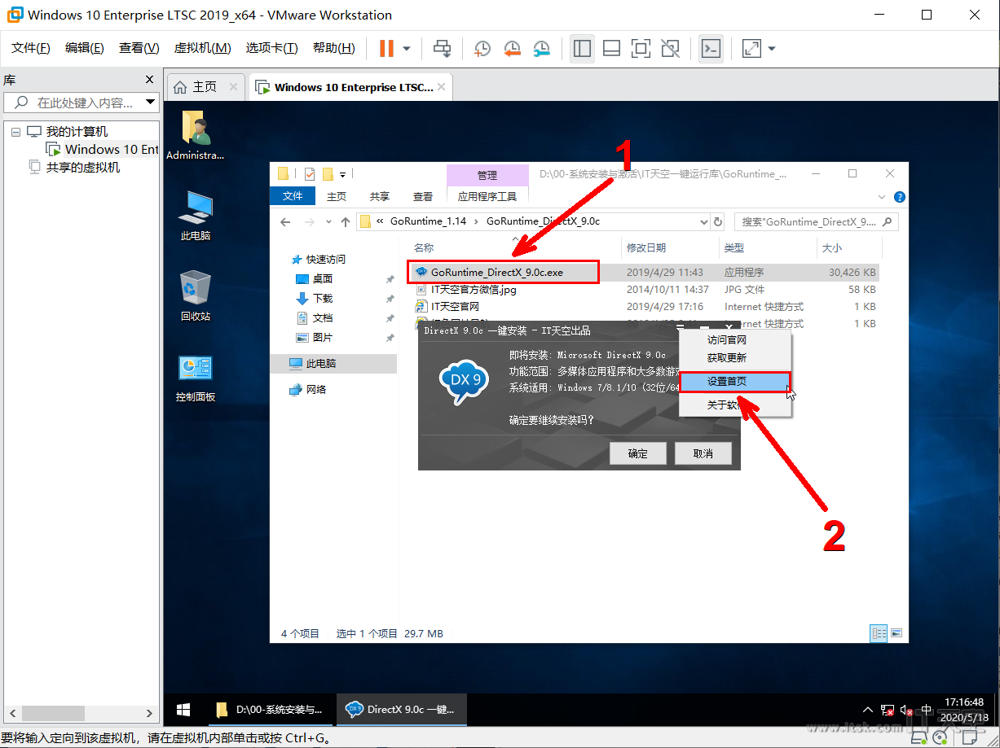
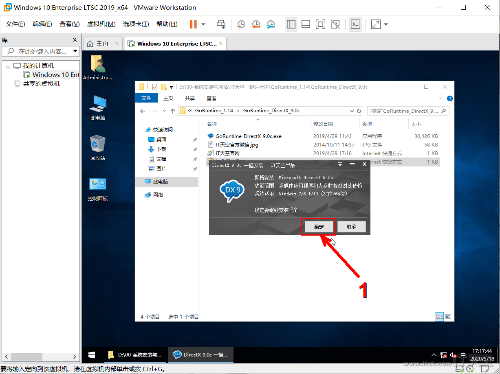

=== 安装link:https://www.ghxi.com/yxkhj.html[微软常用运行库合集]
打开link:https://www.ghxi.com/yxkhj.html[微软常用运行库合集]安装包后，依次点击下一步即可完成安装。
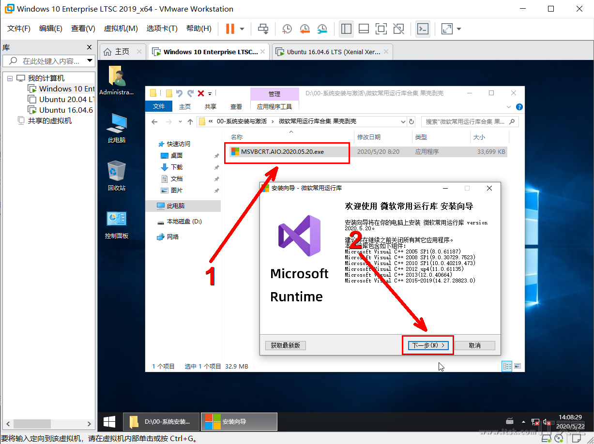
image:images/运行库安装2.png[align=center]
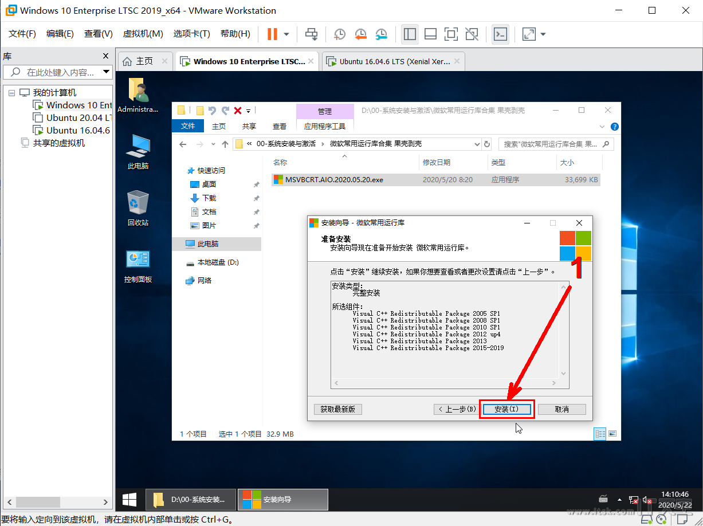
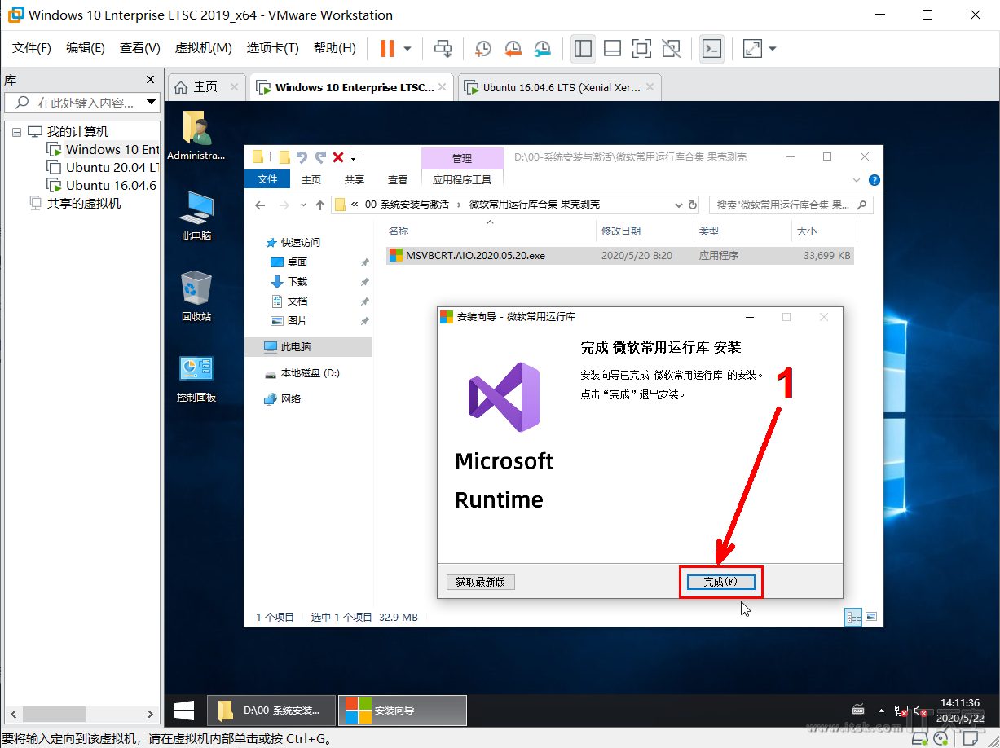

## 安装link:https://www.7-zip.org/[7zip]
打开link:https://www.7-zip.org/[7zip]安装包，依次点击下一步即可完成安装。并按照下面步骤设置link:https://www.7-zip.org/[7zip]：
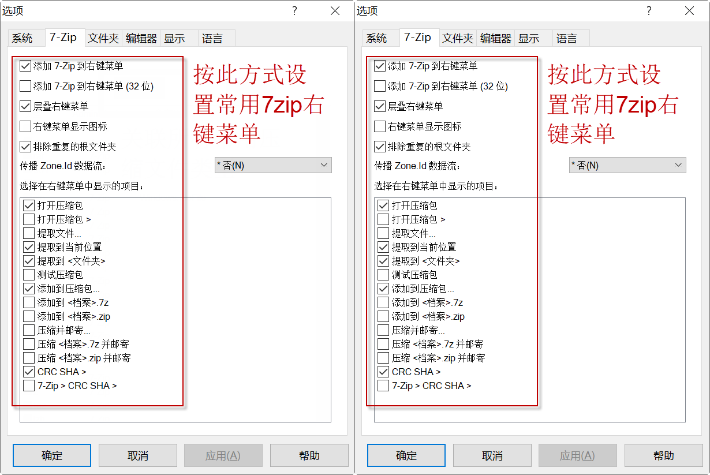

== 安装link:https://www.423down.com/791.html[Chrome浏览器]和插件
. 打开安装包选择安装目录（注意选择C盘下的目录），点击"是"即可完成安装。
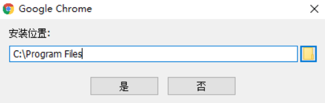
. 打开Chromelink:chrome://extensions/[扩展程序]并开启开发者模式，拖动插件link:https://chrome.zzzmh.cn/info/aefehdhdciieocakfobpaaolhipkcpgc[Simple Allow Copy 0.8.3]、link:https://chrome.zzzmh.cn/info/cjpalhdlnbpafiamejdnhcphjbkeiagm[uBlock Origin]、link:https://chrome.zzzmh.cn/info/dhdgffkkebhmkfjojejmpbldmpobfkfo[Tampermonkey]至link:chrome://extensions/[扩展程序]页面进行安装；
. 打开【设置-应用-默认应用】将chrome设置为默认浏览器。
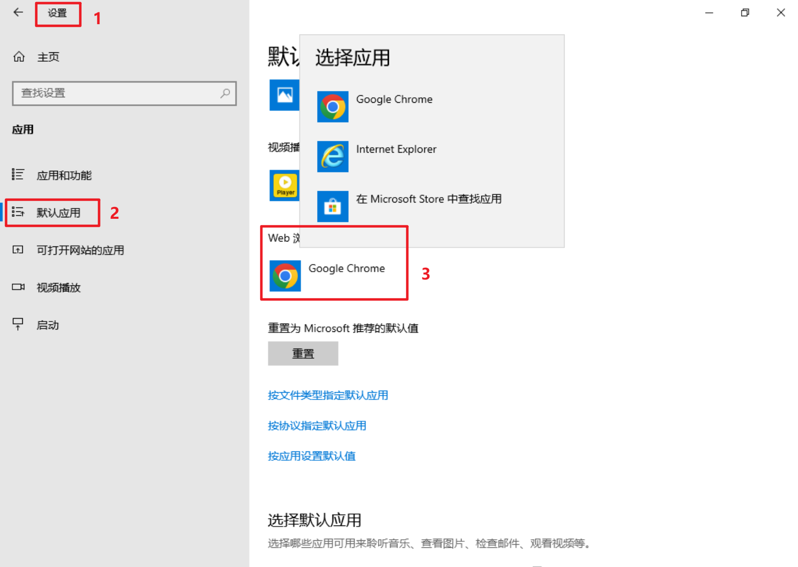

== 安装link:https://www.yrxitong.com/h-nd-1030.html[Office2021]
. 打开离线link:https://www.yrxitong.com/h-nd-1030.html[Office2021]安装包后，选择相应组件（通常选择word/excel/powerpoint）一键安装。
. 安装完成使用link:https://www.yrxitong.com/h-nd-759.html[系统和Office激活工具_HEU KMS Activator]激活link:https://www.yrxitong.com/h-nd-1030.html[Office2021]；
. 把桌面不常用用到的office快捷方式给删除。
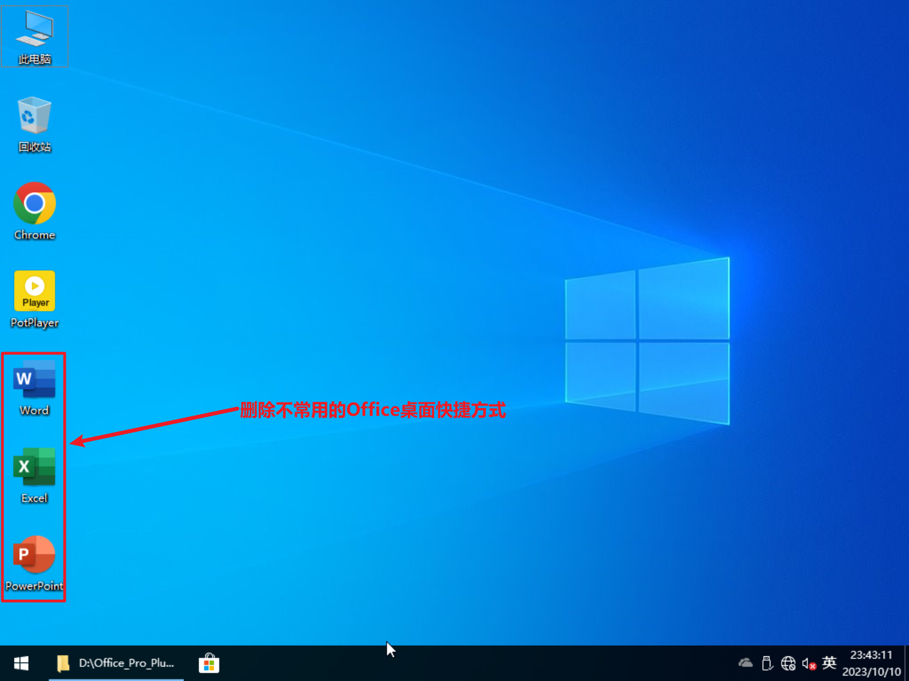

== 安装link:https://www.423down.com/3050.html[PotPlayer]
打开link:https://www.423down.com/3050.html[PotPlayer]安装包，依次点击下一步即可完成安装。

== 专业工具安装
. 下载以下专业工具：

* link:https://www.yrxitong.com/h-nd-759.html[系统和Office激活工具_HEU KMS Activator]
[listing]
此工具前面的步骤已下载，无需再次下载。
* link:https://www.voidtools.com/zh-cn/[Everything]
* link:https://github.com/QL-Win/QuickLook/releases[QuickLook]

. 拷贝专业工具至C:\Program Files目录下，并分别创建快捷方式；
. 跳转到C:\ProgramData\Microsoft\Windows\Start Menu\Programs，创建专业工具目录，并将上面创建的程序快捷方式拷贝至此目录下。
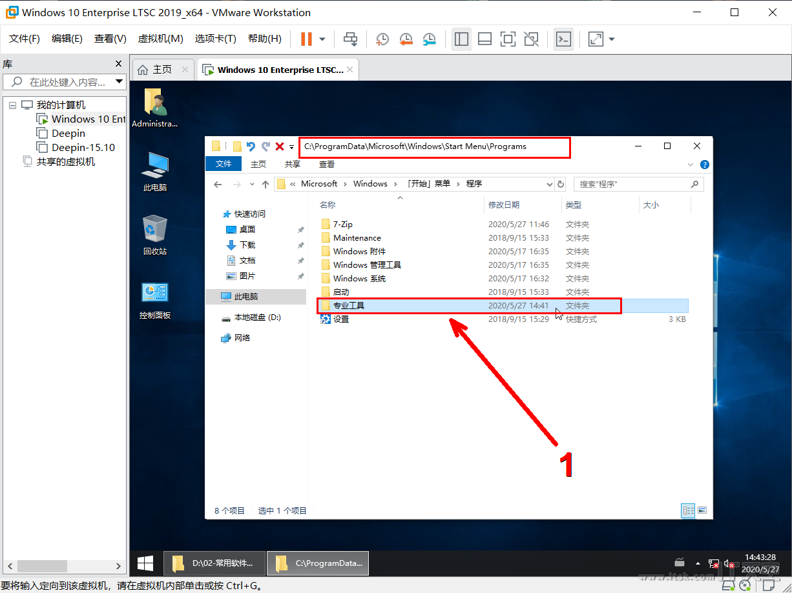

## 拍摄快照备份
TIP: 常用软件目前只安装更新频率慢且经常用的，其他应用如QQ/微信/迅雷等非必须且更新迭代很快的软件不建议安装，此类应用建议直接下载绿色免安装版。

最后，在进行下一个阶段前，记得做一次快照备份。
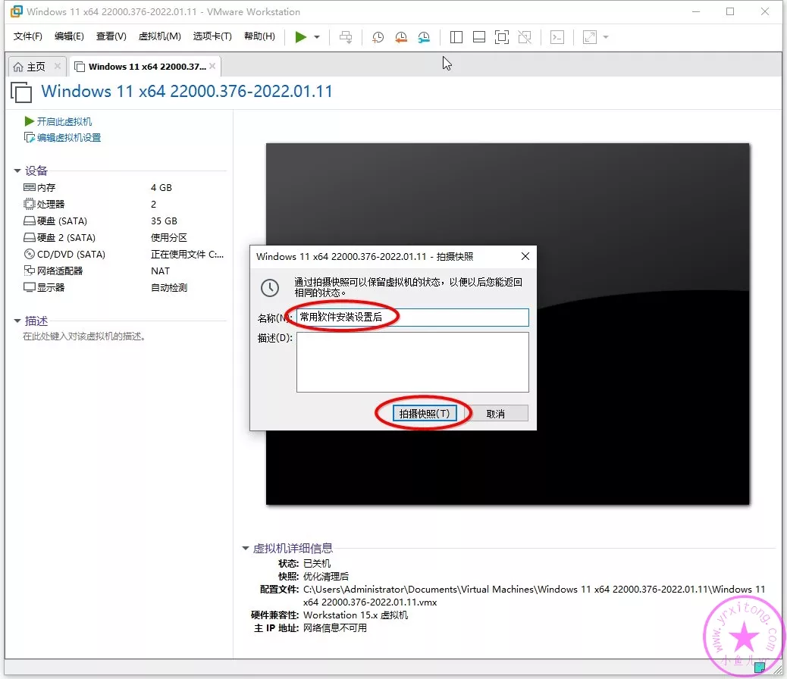