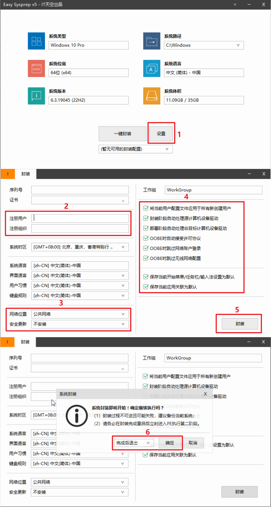
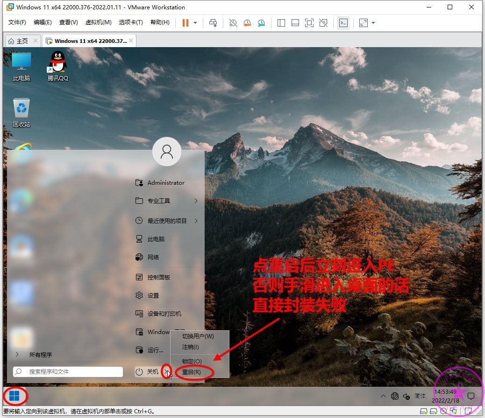
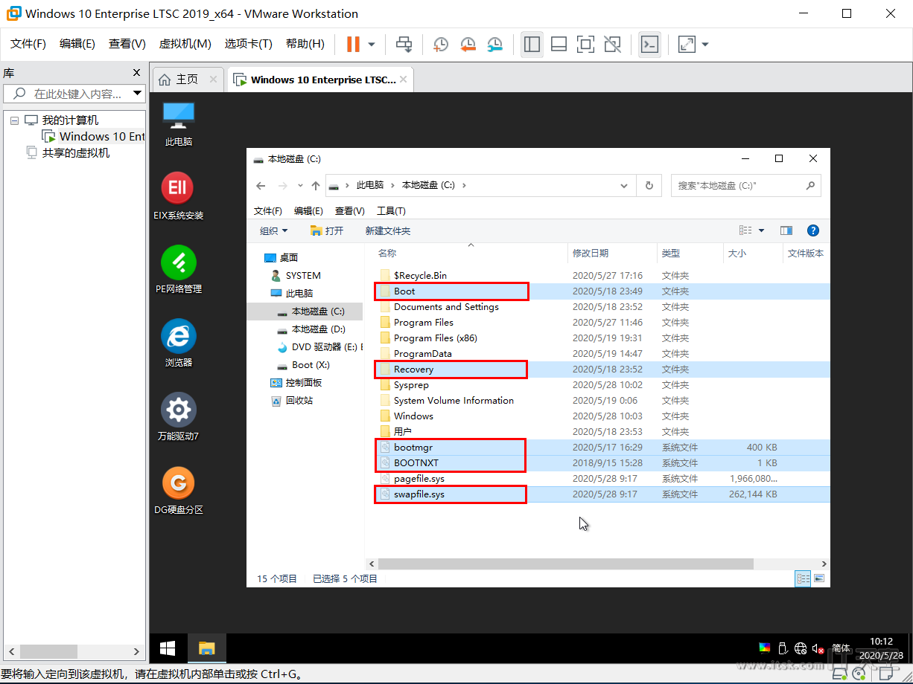
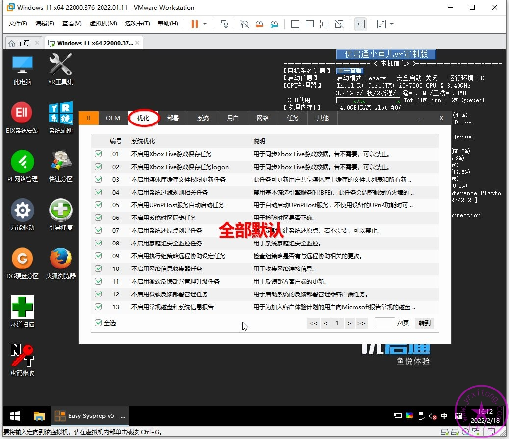
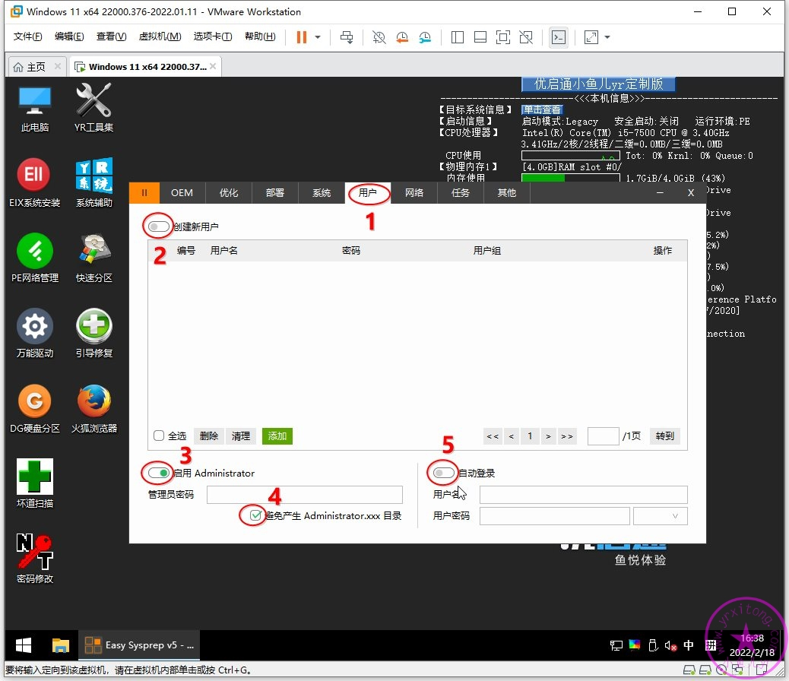
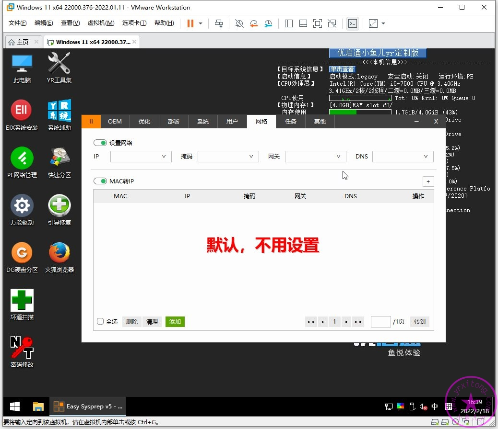
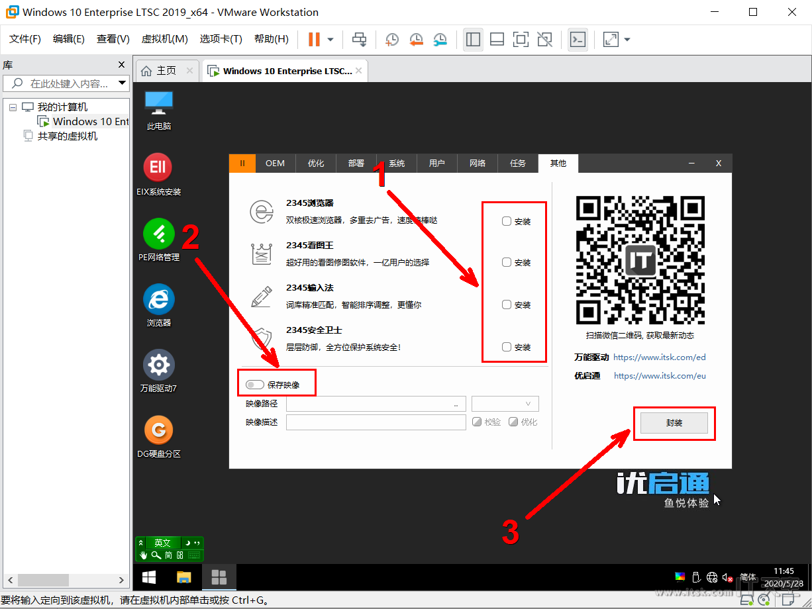

= ES5封装
:toc: left

== ES5S封装第一阶段设置
. 进入桌面环境，打开ES5S依次按照下图操作进行第一阶段设置。

. 第一阶段完成后我们立刻重启进入优启通PE

== ES5S封装第二阶段设置
进入PE环境，打开ES5S依次按照下图操作进行第二阶段设置。
进入PE后，删除C盘中的Boot、Recovery、bootmgr、BOOTNXT和swapfile.sys这5个无用的文件和文件夹

这些优化项目都是比较好的推荐优化，默认勾选即可。

部署设置，计算机名我选的是[前缀]-[日期][随机]，这样计算机名一般不会重复。

本人是用内置管理员Administrotar封装的系统，重装系统后也是以内置管理员登录，所以这里关掉“创建新用户”，打开“启用Admin账户”，关闭“自动登录”，记得勾选“避免产生Admin.xxx的用户目录”。

网络设置，没有特殊情况就默认不管。

都设置好后然后就点封装。

== ES5S封装执行结束后的调整
封装执行结束后，我们还需要对目标系统进行最后的调整。先还原系统个性设置。

== 最终打包保存系统镜像文件
然后关闭虚拟机，还原快照！记住，是还原快照，还原到“封装结束准备打包镜像”。

然后开启虚拟机并进入到PE里。按照下图步骤将目标系统分区打包成wim格式的系统镜像。保存位置选数据盘。

映像描述不能是纯数字。点确定后等几分钟即可生成一个属于你自己的系统镜像啦，然后拿去实体机装一个属于你自己的系统吧。

== 参考文档
* https://www.itsk.com/thread/408896