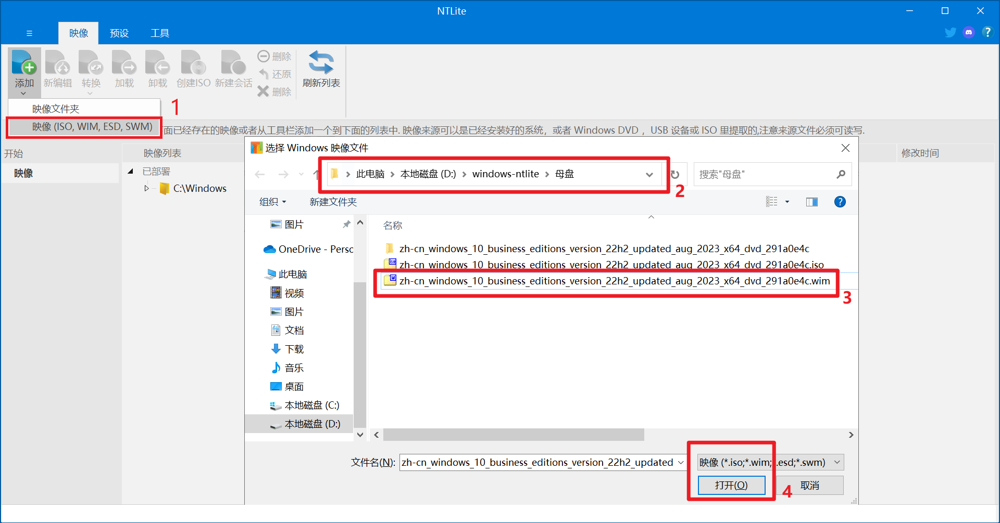
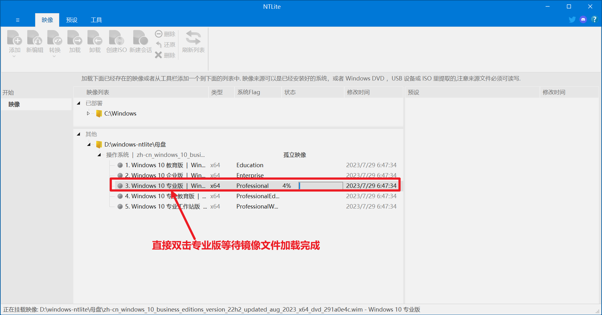
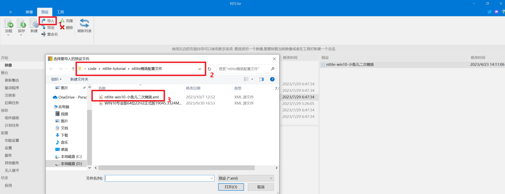
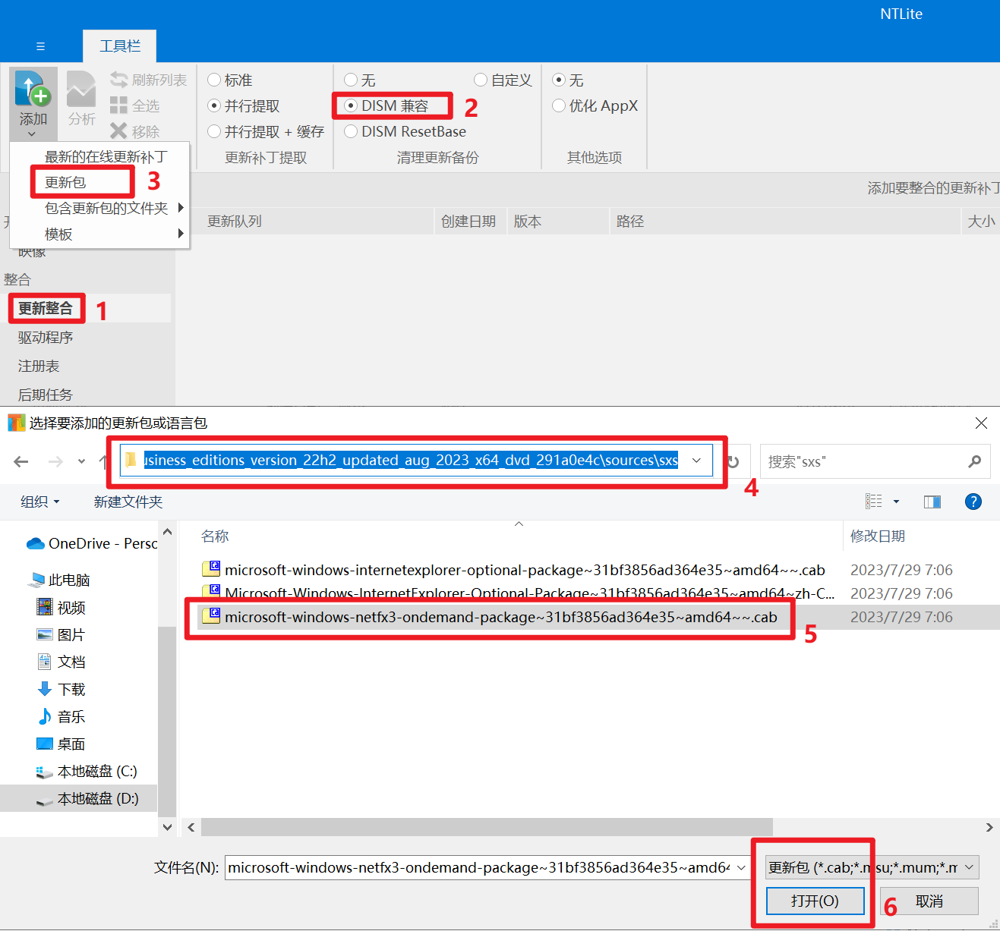
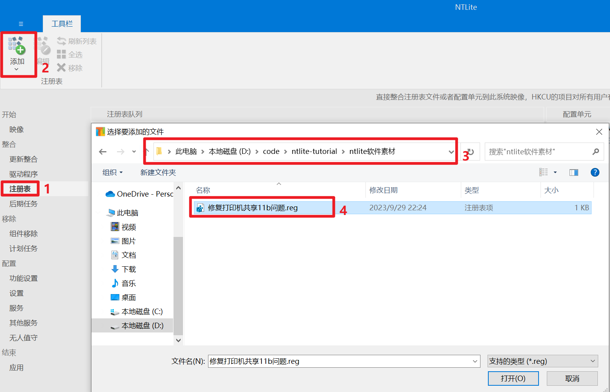
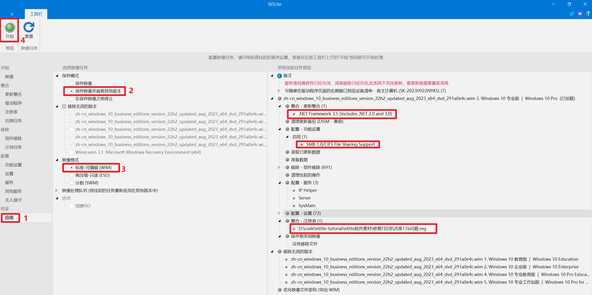

= 母盘制作
:stem: latexmath
:icons: font
:source-highlighter: highlight.js
:sectnums:
:sectlinks:
:sectnumlevels: 4
:toc:
:toc-title: 目录
:toclevels: 4

== 用到的软件

. link:https://www.ntlite.com/download/[ntlite官方最新版本]
. link:https://next.itellyou.cn/Original/[windows10 原版镜像]

== 母盘制作过程

. 解压镜像``zh-cn_windows_10_enterprise_ltsc_2021_x64.iso``得到``zh-cn_windows_10_enterprise_ltsc_2021_x64``文件夹.
. 拷贝``zh-cn_windows_10_enterprise_ltsc_2021_x64/sources/install.wim``系统映像文件至其他目录，并重命名为``zh-cn_windows_10_enterprise_ltsc_2021_x64.wim``.
. 打开 ntlite 选择``zh-cn_windows_10_enterprise_ltsc_2021_x64.wim``添加镜像文件.

. 双击专业版加载系统映像文件.

. 导入link:ntlite精简配置文件/WIN10专业版64位22H2正式版19045.3324MSDN8月适度精简母盘（2023-08-18）NTLite配置文件.xml[win10_ltsc版ntlite精简xml配置文件]

. 从解压文件夹``zh-cn_windows_10_enterprise_ltsc_2021_x64/sources/sxs``中添加更新包.net3.5，以便支持某些老软件比如 CAD 等

. 导入link:ntlite软件素材/修复打印机共享11b问题.reg[修复打印机共享11b问题.reg]解决共享打印机 11b 报错问题

. 最后我们大体上浏览核实一下所有精简设置的内容，记得选择保存为 WIM 格式，并选择裁减其它映像，点【开始】应用所有设置并开始执行操作，这个过程大约几分钟.

== link:ntlite精简配置文件/WIN10专业版64位22H2正式版19045.3324MSDN8月适度精简母盘（2023-08-18）NTLite配置文件.xml[win10_ltsc版ntlite精简xml配置文件]说明
配置文件主要精简和设置了以下功能: +
--
. 移除部分很少使用的组件.
. 禁用系统保留空间.
. 勾选``SMB 1.0/CIFS File Sharing Support``，以保证``Windows XP``可以正常访问``Windows 10``的共享文件和打印机.
. 禁用的服务:
.. ``SysMain``: 超级预读服务很占内存，并且对固态硬盘几乎是负优化，如果你使用的是固态硬盘那么建议禁用
.. ``BitLocker Drive Encryption Service``: 如果您不使用BitLocker加密硬盘，您可以毫无风险地停用服务
.. ``Remote Desktop Services``(远程桌面服务): 除非你从另一台设备远程连接到你的计算机， 您可以禁用此服务
.. ``Windows Search``: windows自带的搜索功能速度特别慢，而且搜索的时候会占用大量的系统资源，建议禁用并使用第三方工具代替(如Everything)
.. ``Print Spooler``: 如果你电脑不需要连接打印机，可以禁用掉此服务
.. ``Windows Biometric Service``(指纹和面部识别): 这个功能只是在特定的环境中使用，在家用的电脑上几乎用不到这个功能，建议禁用
.. ``Remote Registry``(允许远程用户修改注册表): 建议禁用，可提高系统安全性
.. 家长控制: 对windows子账户强制执行家长控制, 如果不需要可以禁用
.. edge浏览器更新服务: 该服务会在后台一直运行占用系统资源，您可以使用第三方工具对浏览器进行更新，从而禁用此服务
.. ``Windows Image Acquisition``: 为扫描仪、相机提供图像采集, 如果电脑没有连接扫描仪或者相机，不需要采集图像，可以禁用
.. ``Connected User Experiences and Telemetry``(互联用户体验和遥测): 反馈系统的错误给微软, 可以禁用
.. windows 备份: 一般不会使用，可禁用
.. windows 推送通知系统服务: 占用大量系统资源，建议禁用
.. Telephony(电话服务)：旨在通过您的电脑拨打电话或连接智能手机.如果不喜欢，请删除它
.. Smart Card(智能卡及相关服务)：仅当您使用智能卡进行身份验证时才有用.如果您不知道它是什么，请禁用它
.. Work Folders(工作文件)：仅当您处于公司环境中并在中央服务器上共享文件时，它们才有意义
.. Xbox 服务： 从个人资料管理到游戏保存.如果您不是游戏玩家，您可以将其全部关闭
.. 传感器服务： 它用于 GPS 或环境光等传感器.如果您的设备没有这些传感器，您就不需要它们.
.. 打印后台处理程序（打印队列）： 仅当您有打印机时才需要.如果您不使用任何功能，请禁用它.
--

== 参考文档

- link:https://www.itsk.com/thread/408614[Windows 10 Enterprise LTSC 2019_x64 极度精简超详细 ES5 封装过程（一、系统精简）]
- link:https://www.yrxitong.com/h-nd-311.html[【封装系列】ES5 高效封装 WIN10 系统教程 2020 系列（一）母盘定制]
- link:https://www.xiamuyan.com/share/windows-system/streamline-windows-system-with-ntlite.html[NTLite 精简定制 Windows 系统]
- link:https://www.yrxitong.com/h-nd-1101.html[2022 年全新 Windows11 系统封装图文教程（一）定制母盘]