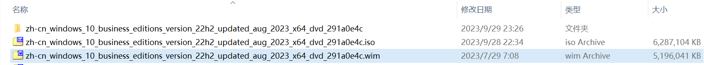

# 母盘制作

## 用到的软件

- [ntlite 官方最新版本](https://www.ntlite.com/download/)
- [windows10 原版镜像](https://www.yrxitong.com/h-col-130.html)
- [修复打印机共享 11b 问题（注册表 reg 文件）](ntlite软件素材/修复打印机共享11b问题.reg)
- [ntlite 精简 xml 配置文件](ntlite精简配置文件/WIN10专业版64位22H2正式版19045.3324MSDN8月适度精简母盘（2023-08-18）NTLite配置文件.xml)
  配置文件主要精简和设置了以下功能:
  - 绝大部分不用组件(组件列表过多，不一一列举)。
  - 禁用系统保留空间。
  - 勾选 SMB 1.0/CIFS File Sharing Support，以保证 Windows XP 可以正常访问 Windows 10 的共享文件和打印机。
  - 禁用 SysMain 服务（超级预读服务很占内存，并且对固态硬盘几乎是负优化，如果你使用的是固态硬盘那么建议禁用）。

## 母盘制作过程

- 解压镜像`zh-cn_windows_10_enterprise_ltsc_2021_x64.iso`得到 `zh-cn_windows_10_enterprise_ltsc_2021_x64`文件夹。
- 拷贝`zh-cn_windows_10_enterprise_ltsc_2021_x64/sources/install.wim`系统映像文件至其他目录，并重命名为`zh-cn_windows_10_enterprise_ltsc_2021_x64.wim`。
  
- 打开 ntlite 选择`zh-cn_windows_10_enterprise_ltsc_2021_x64.wim`添加镜像文件。
  
- 双击专业版加载系统映像文件；
  
- 导入[ntlite 精简 xml 配置文件](ntlite精简配置文件/WIN10专业版64位22H2正式版19045.3324MSDN8月适度精简母盘（2023-08-18）NTLite配置文件.xml)；
  
- 从解压文件夹`zh-cn_windows_10_enterprise_ltsc_2021_x64/sources/sxs`中添加更新包.net3.5，以便支持某些老软件比如 CAD 等；
  
- 导入[修复打印机共享 11b 问题（注册表 reg 文件）](ntlite软件素材/修复打印机共享11b问题.reg)解决共享打印机 11b 报错问题；
  

- 最后我们大体上浏览核实一下所有精简设置的内容，记得选择保存为 WIM 格式，并选择裁减其它映像，点【开始】应用所有设置并开始执行操作，这个过程大约几分钟。
  

## 参考文档

- [Windows 10 Enterprise LTSC 2019_x64 极度精简超详细 ES5 封装过程（一、系统精简）](https://www.itsk.com/thread/408614)
- [【封装系列】ES5 高效封装 WIN10 系统教程 2020 系列（一）母盘定制](https://www.yrxitong.com/h-nd-311.html)
- [NTLite 精简定制 Windows 系统](https://www.xiamuyan.com/share/windows-system/streamline-windows-system-with-ntlite.html)
  [2022 年全新 Windows11 系统封装图文教程（一）定制母盘](https://www.yrxitong.com/h-nd-1101.html)
