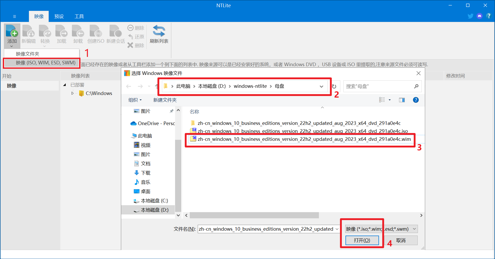
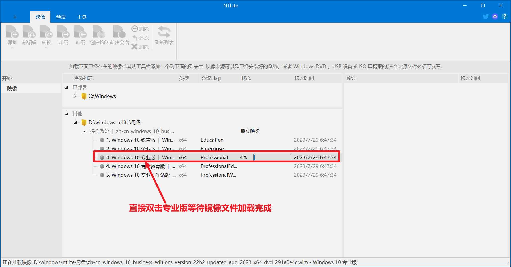
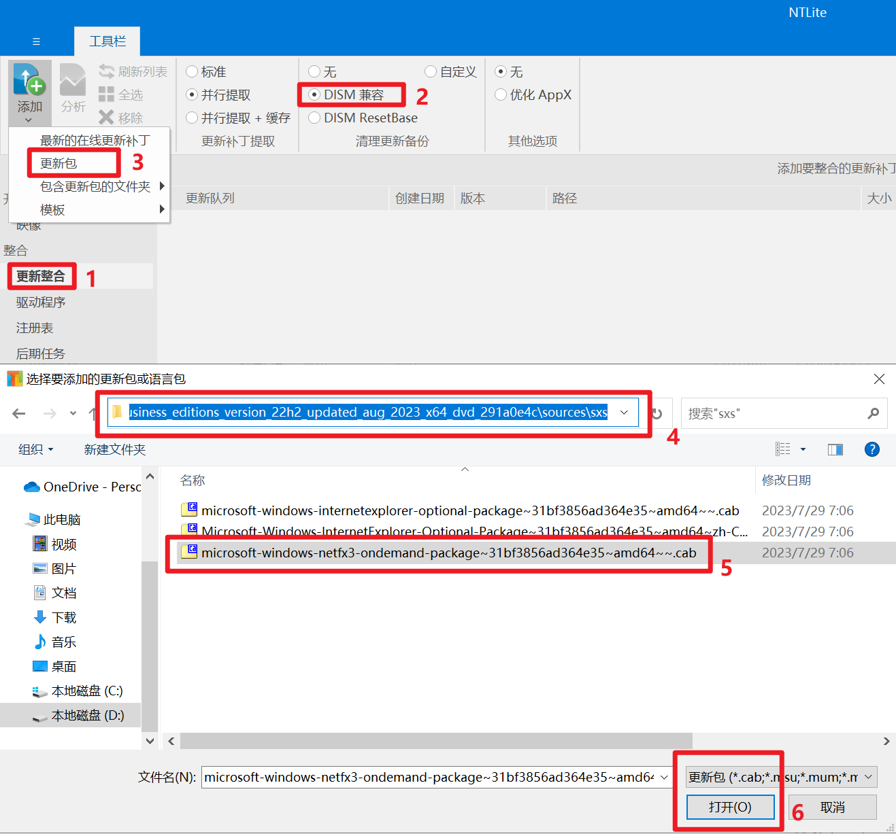
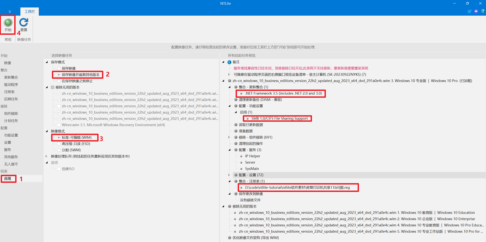

# 母盘制作

## 用到的软件

- [ntlite 官方最新版本](https://www.ntlite.com/download/)
- [windows10 原版镜像](https://www.yrxitong.com/h-col-130.html)
- [修复打印机共享 11b 问题（注册表 reg 文件）](ntlite软件素材/修复打印机共享11b问题.reg)
- [ntlite 精简 xml 配置文件](ntlite精简配置文件/WIN10专业版64位22H2正式版19045.3324MSDN8月适度精简母盘（2023-08-18）NTLite配置文件.xml)
  配置文件主要精简和设置了以下功能:
  - 绝大部分不用组件(组件列表过多，不一一列举)。
  - 禁用系统保留空间。
  - 勾选 SMB 1.0/CIFS File Sharing Support，以保证 Windows XP 可以正常访问 Windows 10 的共享文件和打印机。
  - 服务优化说明
    1. SysMain: 超级预读服务很占内存，并且对固态硬盘几乎是负优化，如果你使用的是固态硬盘那么建议禁用
    2. BitLocker Drive Encryption Service: 如果您不使用 BitLocker 加密硬盘， 您可以毫无风险地停用服务
    3. Remote Desktop Services(远程桌面服务): 除非你从另一台设备远程连接到你的计算机， 您可以禁用此服务
    4. Windows Search: windows自带的搜索功能速度特别慢，而且搜索的时候会占用大量的系统资源，建议禁用并使用第三方工具代替(如Everythin)
    5. Print Spooler: 如果你电脑不需要连接打印机，可以禁用掉此服务
    6. Windows Error Reporting: 在系统出现崩溃或系统错误的时候，这个服务会把错误的信息发送给微软，但是发送之后也不见得给你解决，建议禁用此服务
    7. Windows Biometric Service(指纹和面部识别): 这个功能只是在特定的环境中使用，在家用的电脑上几乎用不到这个功能，建议禁用
    8. Remote Registry(允许远程用户修改注册表): 建议禁用，可提高系统安全性
    9. 家长控制: 对windows子账户强制执行家长控制, 如果不需要可以禁用
    10. edge浏览器更新服务: 该服务会在后台一直运行占用系统资源，您可以使用第三方工具对浏览器进行更新，从而禁用此服务
    12. Windows Image Acquisition: 为扫描仪、相机提供图像采集, 如果电脑没有连接扫描仪或者相机，不需要采集图像，可以禁用
    13. Connected User Experiences and Telemetry(互联用户体验和遥测): 反馈系统的错误给微软, 可以禁用
    14. windows 备份: 一般不会使用，可禁用
    15. windows 推送通知系统服务: 占用大量系统资源，建议禁用
    18. Telephony(电话服务)：旨在通过您的电脑拨打电话或连接智能手机。如果不喜欢，请删除它
    19. Smart Card(智能卡及相关服务)：仅当您使用智能卡进行身份验证时才有用。如果您不知道它是什么，请禁用它
    21. Work Folders(工作文件)：仅当您处于公司环境中并在中央服务器上共享文件时，它们才有意义
    22. Xbox 服务： 从个人资料管理到游戏保存。如果您不是游戏玩家，您可以将其全部关闭
    23. 传感器服务： 它用于 GPS 或环境光等传感器。如果您的设备没有这些传感器，您就不需要它们。
    24. 打印后台处理程序（打印队列）： 仅当您有打印机时才需要。如果您不使用任何功能，请禁用它。
    > 25. Windows Insider Program：如果你不是Windows Insider Program成员，可以关闭此服务项
    > 26. Windows Defender Antivirus：如果你已经安装了其他杀毒软件，可以关闭此服务项
    > 27. Windows Defender SmartScreen：此服务项用于检测恶意软件和钓鱼网站，关闭后可能会增加系统感染恶意软件的风险
    > 28. Windows Hello：如果你不使用Windows Hello功能，可以关闭此服务项

## 母盘制作过程

- 解压镜像`zh-cn_windows_10_enterprise_ltsc_2021_x64.iso`得到 `zh-cn_windows_10_enterprise_ltsc_2021_x64`文件夹。
- 拷贝`zh-cn_windows_10_enterprise_ltsc_2021_x64/sources/install.wim`系统映像文件至其他目录，并重命名为`zh-cn_windows_10_enterprise_ltsc_2021_x64.wim`。
  
- 打开 ntlite 选择`zh-cn_windows_10_enterprise_ltsc_2021_x64.wim`添加镜像文件。
  
- 双击专业版加载系统映像文件；
  
- 导入[ntlite 精简 xml 配置文件](ntlite精简配置文件/WIN10专业版64位22H2正式版19045.3324MSDN8月适度精简母盘（2023-08-18）NTLite配置文件.xml)；
  
- 从解压文件夹`zh-cn_windows_10_enterprise_ltsc_2021_x64/sources/sxs`中添加更新包.net3.5，以便支持某些老软件比如 CAD 等；
  
- 导入[修复打印机共享 11b 问题（注册表 reg 文件）](ntlite软件素材/修复打印机共享11b问题.reg)解决共享打印机 11b 报错问题；
  

- 最后我们大体上浏览核实一下所有精简设置的内容，记得选择保存为 WIM 格式，并选择裁减其它映像，点【开始】应用所有设置并开始执行操作，这个过程大约几分钟。
  

## 参考文档

- [Windows 10 Enterprise LTSC 2019_x64 极度精简超详细 ES5 封装过程（一、系统精简）](https://www.itsk.com/thread/408614)
- [【封装系列】ES5 高效封装 WIN10 系统教程 2020 系列（一）母盘定制](https://www.yrxitong.com/h-nd-311.html)
- [NTLite 精简定制 Windows 系统](https://www.xiamuyan.com/share/windows-system/streamline-windows-system-with-ntlite.html)
- [2022 年全新 Windows11 系统封装图文教程（一）定制母盘](https://www.yrxitong.com/h-nd-1101.html)