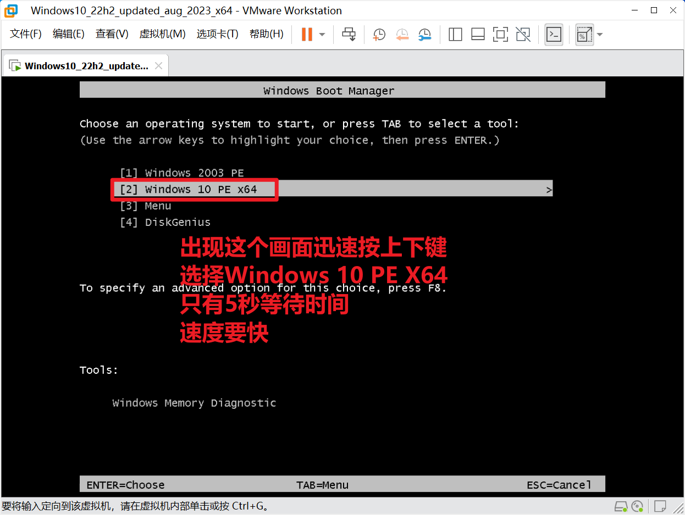

= 准备封装环境和母盘安装
:toc: left
:toc-title: 目录
:toclevels: 4

== 制作一个用于封装的优启通PE镜像
下载link:https://www.itsk.com/thread/430619[优启通]后, 打开优启通后``EasyU_v3.7.exe``, 按照下图步骤制作ISO镜像.
image:images/制作优启通PE镜像文件.png[align=center]

[#精简后的万能驱动]
== 精简link:https://www.itsk.com/thread/430358[万能驱动]
有些网上下载的系统镜像很小只有5G左右, 并且重装系统也有万能驱动的安装界面.或许你会很疑惑, 实际上这种镜像是精简了万能驱动包才会如此小.IT天空官网有详细的精简教程, 那么今天我就顺便简单演示一下如何精简万能驱动.打开Sysprep文件夹里的万能驱动文件夹, 如下图路径.下面是5个大类的驱动包, 要精简哪个驱动包就直接将那个驱动包删除, 然后将对应的配置文件一并删除即可.比如我们要精简声卡驱动, 那么Shift+Delete删掉[Audio]Drivers文件夹和[Audio]EasyDrv7.ini配置文件即可.一般我们可以将声卡驱动包和显卡驱动包精简掉.这样万能驱动实际上只有两百多M了. 一下就可以腾出5个多G的空间.

== 安装link:https://www.ghxi.com/workstationlite.html[VMware-workstation-16]
下载link:https://www.ghxi.com/workstationlite.html[VMware-workstation-16]后, 打开link:https://www.ghxi.com/workstationlite.html[VMware-workstation-16]安装包, 依次点击下一步即可完成安装.

== 创建一个适合封装WIN10 64位系统的虚拟机环境
. 按照下图步骤初步设置好虚拟机Windows10系统的配置.
image:images/新建虚拟机环境.png[align=center]
. 进入自定义硬件界面, 删掉不必要的4个硬件(为了防止一安装完母盘就直接联网, 网络适配器一定要暂时移除, 需要的时候我们再将其添加进来).

[#虚拟机BIOS设置]
== 虚拟机BIOS设置
. 如下图, 点击三角形旁边的下拉三角形选择打开电源时进入固件进入虚拟机BIOS.
image:images/进入虚拟机BIOS.png[align=center]
. 进入BIOS设置, 定位到Advanced的I/O设置.
image:images/定位到Advanced的IO设置.png[align=center]
. 全部改为Disabled关掉不必要的东西, 减少不必要的影响.
image:images/Disabled关掉不必要的东西.png[align=center]
.  按“＋”加号和“－”减号调上下来更改启动项(或者SHIFT键+“＋”加号, Fn键+“－”减号), 使CD-ROM Drive为第一启动项, +Hard Drive为第二启动项.

. 设置完成后按F10保存退出.
image:images/按F10保存退出.png[align=center]

== 虚拟机分区
. <<虚拟机BIOS设置>>步骤之后进入windows boot manager, 迅速选择 [2] Windows 10 PE x64, 这里只有5s等待时间.

. 进入桌面后, 打开DiskGenius分区工具, 以MBR硬盘格式快速分成2个分区, 这里C盘系统盘设置为35G, D盘为数据盘设置为25G, 并记得4K对齐.

image:images/快速分2个区.png[align=center]
. 检查一下分区是否正确, 如果盘符有问题, 重启后即可恢复正常.

. 关闭虚拟机PE系统.

== 磁盘映射
. 分区完成后关闭虚拟机PE系统, 准备虚拟机磁盘映射.

TIP: 映射磁盘必须在关机的情况下才能打开磁盘映射, 而且每次要准备虚拟机磁盘映射前都要先进入PE一次, 然后关机后才能操作磁盘映射.这样是为了避免出现复制进虚拟机磁盘里的文件有时候会消失, 或者文件夹打不开, 报错等情况.这里将虚拟机的D盘, 映射为实体机的Z盘.记得把以只读方式打开文件前面的勾去掉.

image:images/磁盘映射.png[align=center]

== 复制下面的软件以及精简后的母盘至Z盘(虚拟机D盘)
TIP: 请提前将软件下载到本地.

* https://www.itsk.com/thread-396895-1-1.html[GoRuntime_DirectX_9.0c运行库]
* https://www.ghxi.com/yxkhj.html[微软常用运行库合集]
* https://www.7-zip.org/[7zip]
****
可替换为其他压缩解压软件如Bandzip, 使用link:https://www.7-zip.org/[7zip]主要因素是其对个人属于免费使用, 更新频率慢.
****
* https://www.yrxitong.com/h-nd-1030.html[Office2021]
****
可替换为link:https://www.ghxi.com/wps2019pro.html[WPS].
****

* https://www.yrxitong.com/h-nd-122.html[软媒清理大师单文件版3.7.8.0]
* https://www.yrxitong.com/h-nd-759.html[系统和Office激活工具_HEU KMS Activator]
* https://www.itsk.com/thread/428084[Easy Sysprep 5S RS2]
* <<精简后的万能驱动>>
* https://github.com/Chuyu-Team/Dism-Multi-language/releases[Dism-Multi-language]
* https://www.yrxitong.com/h-nd-100.html[小鱼儿yr系统封装优化设置辅助工具]

复制完成后记得关闭所有文件夹, 然后才点断开连接, 不然无法断开虚拟机磁盘映射, 没有断开磁盘映射就无法开启虚拟机, 就会报错.
image:images/断开连接.png[align=center]

== 母盘安装
. 开启虚拟机, 进入PE后打开桌面上的EIX系统安装工具, 可以看到EIX已经自动搜索到虚拟机数据盘D盘的windows10镜像文件.按照下图运行EIX2进行映像恢复.左边选待恢复的母盘映像, 右边选系统盘C盘.

. 镜像恢复后重启虚拟机, 到达系统安装设置界面后, 直接按Ctrl+Shift+F3(有些笔记本需要按住Fn+ Ctrl+Shift+F3)进入审核模式.
image:images/审核模式.png[align=center]
. 如图进入桌面后会弹出系统准备工具3.14窗口, 表面已经进入了审核模式, 每次重启它都会弹出, 关闭即可.
image:images/Sysprep的对话框.png[align=center]

== 启用内置Administrotar账户
使用link:https://www.yrxitong.com/h-nd-100.html[小鱼儿yr系统封装优化设置辅助工具]开启Administrotar账户, 选中并单独优化这个项目即可.
image:images/开启Administrotar账户.jpg[align=center]

== 激活系统
使用link:https://www.yrxitong.com/h-nd-759.html[系统和Office激活工具_HEU KMS Activator]激活系统.

== 拍摄快照备份
关闭虚拟机系统, 按照下图步骤设置.快照命名“母盘安装后”, 描述选填, 方便以后查询或恢复使用.
image:images/母盘安装后快照.jpg[align=center]

== 参考教程
* https://www.itsk.com/thread/408641[Windows 10 Enterprise LTSC 2019_x64极度精简超详细ES5封装过程(二、封装准备)]
* https://www.yrxitong.com/h-nd-1102.html[2022年全新Windows11系统封装图文教程(二)准备系统封装环境]