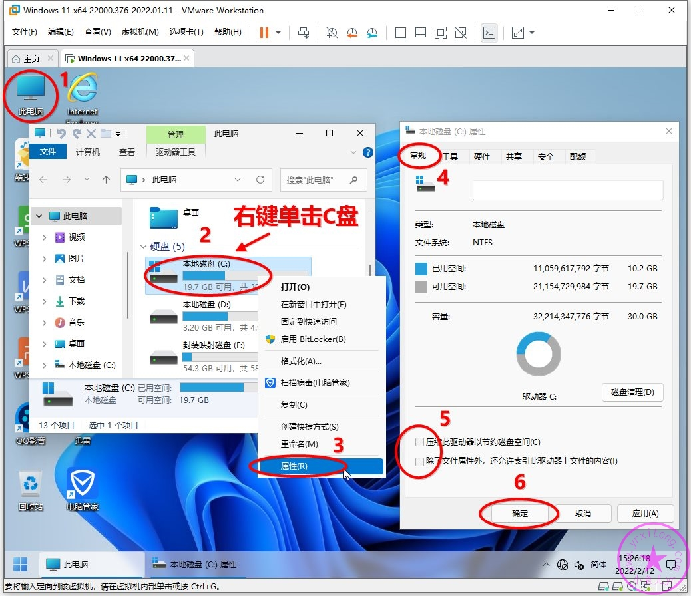
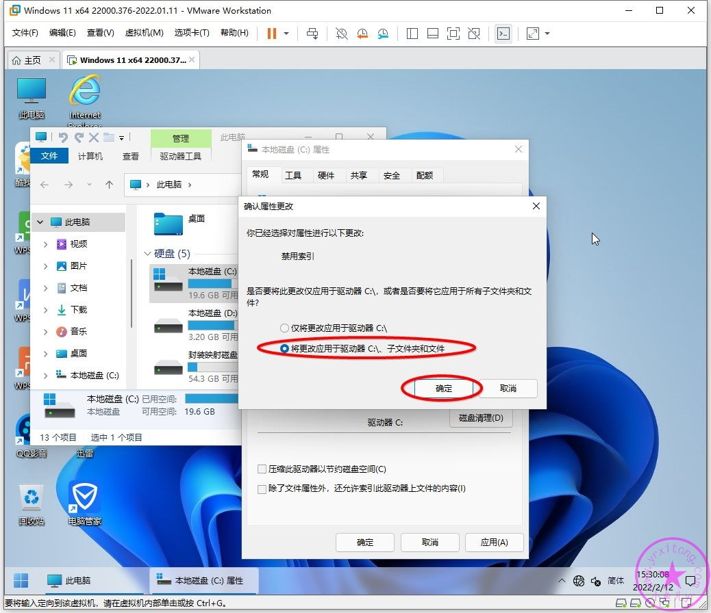
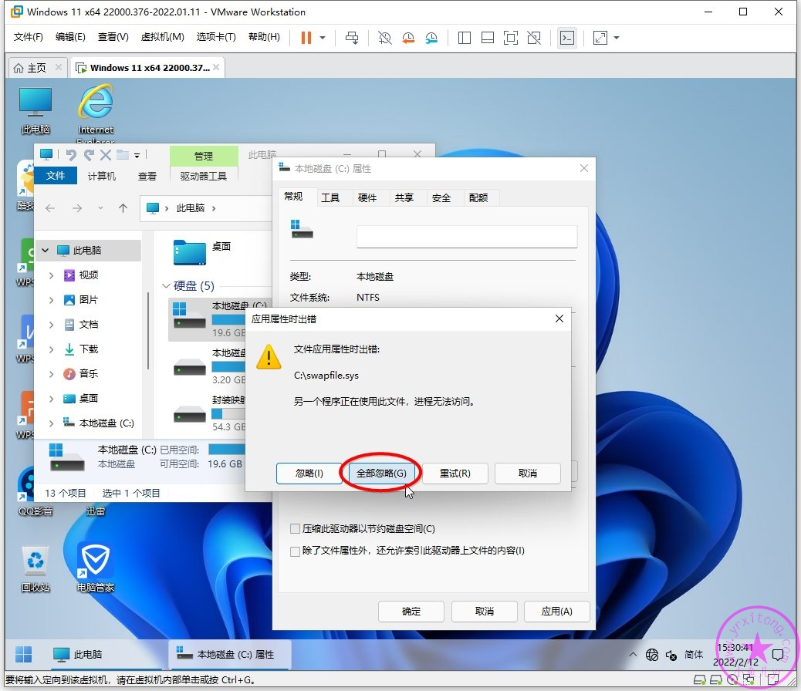
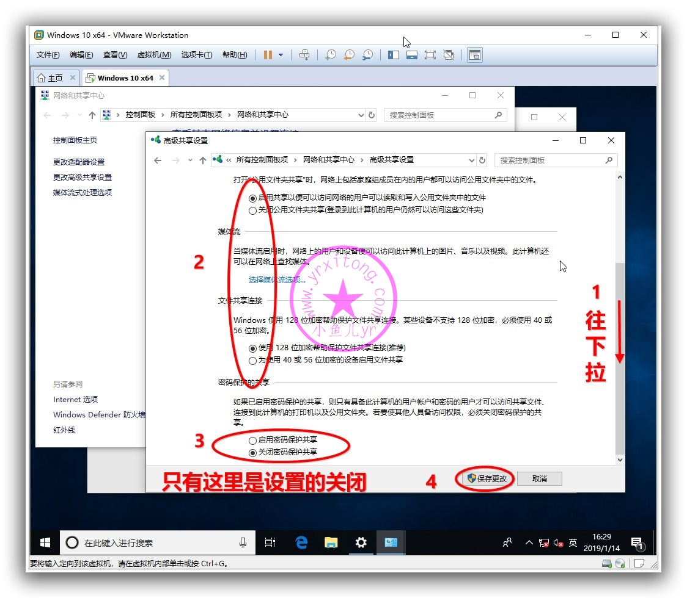
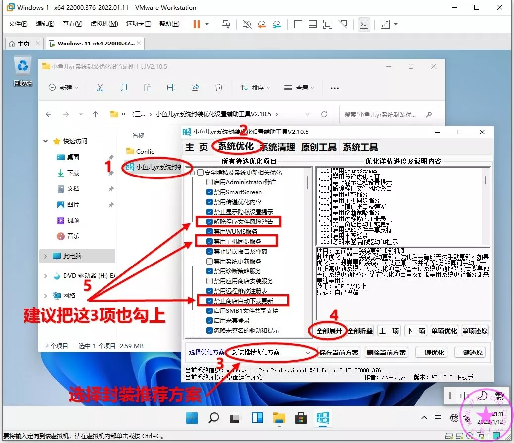
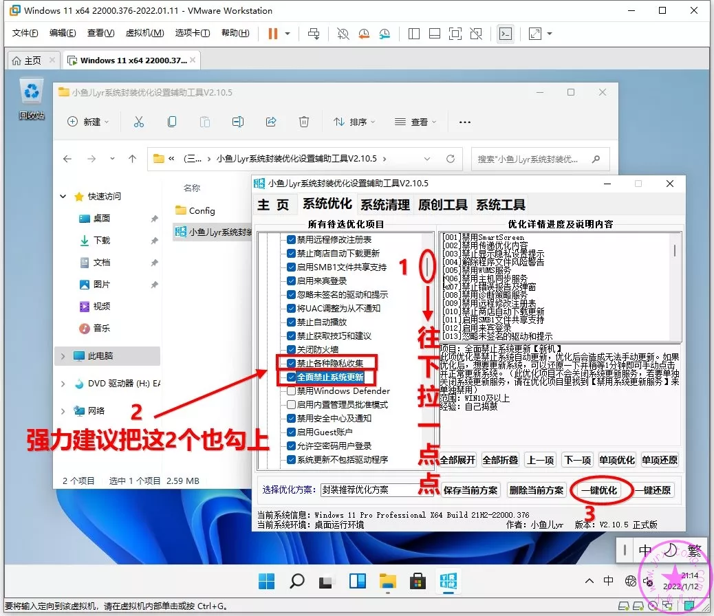
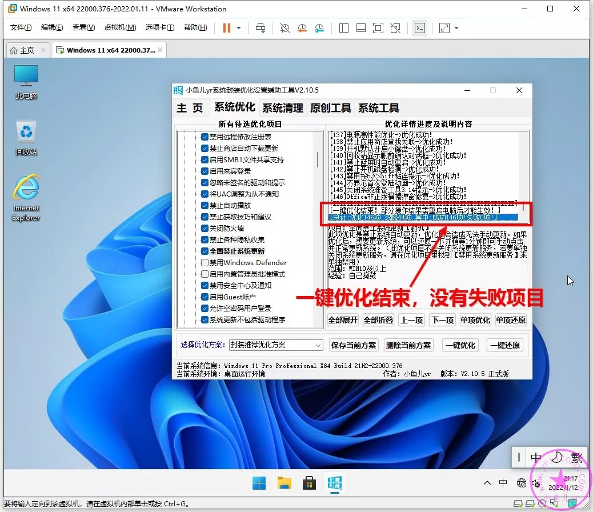
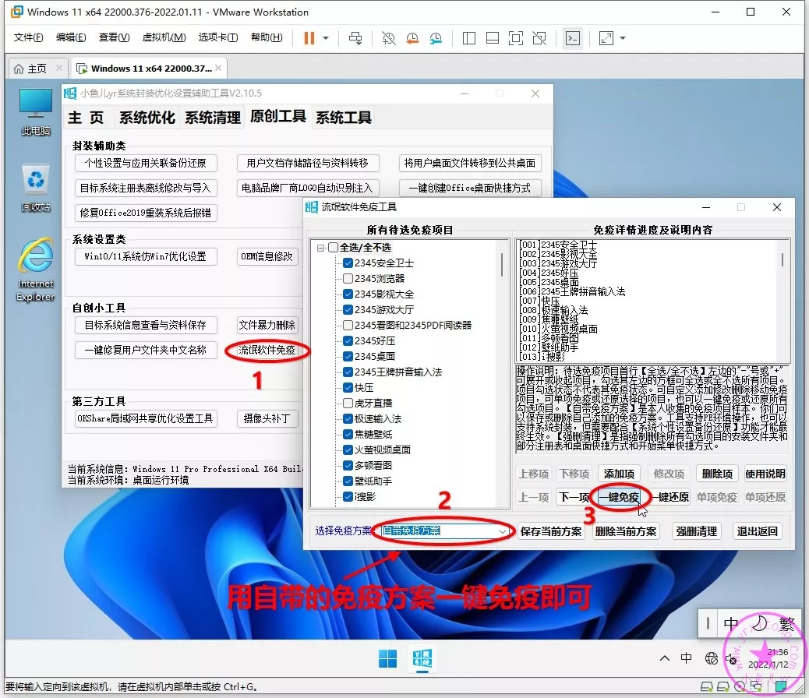
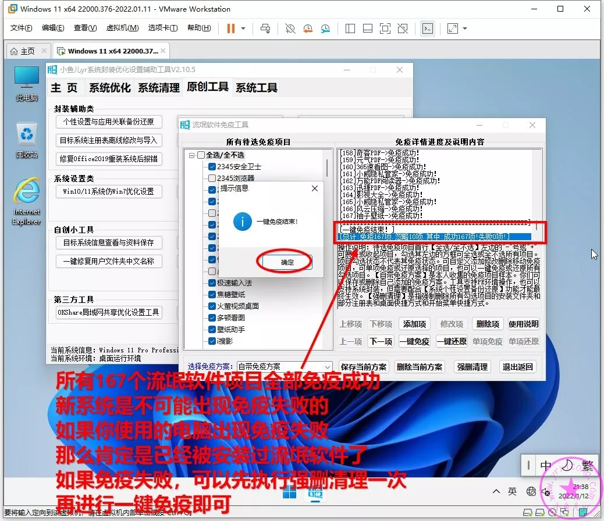
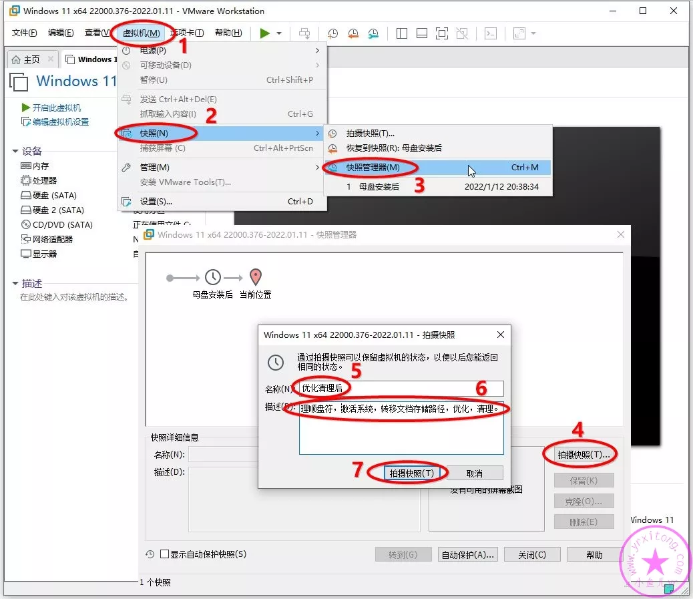

= 使用工具优化
:toc: left
:toc-title: 目录
:toclevels: 4

== 关闭磁盘索引
磁盘索引一般对机械硬盘有用，对固态硬盘基本上没什么用，现在的系统盘基本都是固态硬盘，建议关掉磁盘索引。按照下图步骤，只需要关闭C盘系统盘索引即可。

TIP: 建议机械键盘也关闭磁盘索引，文件检索可使用link:https://www.voidtools.com/zh-cn/downloads/[Everything]替换，性能更加优秀。

== 启用共享
如下图先打开控制面板，然后打网络和共享中心，更改高级共享设置。所有网络里，设置``启用共享以便可以访问网络的用户可以读取和写入共用文件夹中的文件``。

== 使用link:https://www.yrxitong.com/h-nd-100.html[小鱼儿yr系统封装优化设置辅助工具]优化设置与系统清理
按照下图步骤，运行link:https://www.yrxitong.com/h-nd-100.html[小鱼儿yr系统封装优化设置辅助工具]，选择优化栏目，然后选择《封装推荐优化方案》。单独补充增加并勾上：

. 解除程序文件风险警告
. 禁用主机同步服务
. 禁止商店自动下载更新
. 禁止各种隐私收集
. 全面禁止系统更新
. 隐藏快捷方式小箭头
. 不显示快速访问里最近文件
. 不显示快速访问里常用文件夹
. 开启GPU硬件加速
. 显示文件名后缀
. 禁用TCP半开连接的限制

这些优化项目没有归类到【封装推荐优化方案】里，所以要单独勾选一下。

以下选项建议去除：

. 恢复经典系统属性界面
. 在桌面显示IE图标
. 添加右键深浅主题模式

这些选项个人觉得没什么必要。

勾选完后新建一个优化方案，保存后方便随时按照自己的设置进行一键优化。

稍等片刻，就全部优化完成了，提示优化项目全部优化成功。

=== 优化容易遇到的坑
. 对于1903及以上的系统，不要禁用 windows 错误报告服务，即Windows Error Reporting Service。这个服务一旦禁用，打开Widows设置会出现数组越界的BUG或者闪退，甚至可能严重影响系统性能；
. 建议不要禁用系统更新服务，即Windows Update服务。如果禁用了，会出现很多问题，比如无法安装.net3.5，无法使用数字激活工具激活系统，无法使用应用商店下载APP等等；
. 不要禁用Windows防火墙服务，即Windows Firewall服务。如果禁用了，就无法共享打印机；
. 优化《解除程序文件风险警告》后会造成 IE 自带下载器下载的程序，无法在下载器里直接运行；
. 对于1903及以上的系统，优化《禁止商店自动下载更新》后，无法使用新建账户的方式登录系统，会卡在OOBE界面，但不影响内置管理员方式登录系统。所以，如果不是内置管理员封装的系统就不要优化此项。

== 免疫流氓软件
这个功能是让封装的系统避免网络上大多数流氓软件自动安装。可免疫接近200项常见流氓软件。这个免疫功能原理是提前在流氓软件的安装路径设置禁止写入权限，所以此功能不会占用任何内存资源也不会占用任何硬盘空间，不过会生成一些高权限的隐藏文件夹，文件夹大小都是0字节，手动无法删除，可以用link:https://www.yrxitong.com/h-nd-100.html[辅助工具]的暴力删除工具进行删除，但是删除后就无法免疫流氓软件了。

== 拍摄快照备份
关闭虚拟机系统，按照下图拍摄快照。
