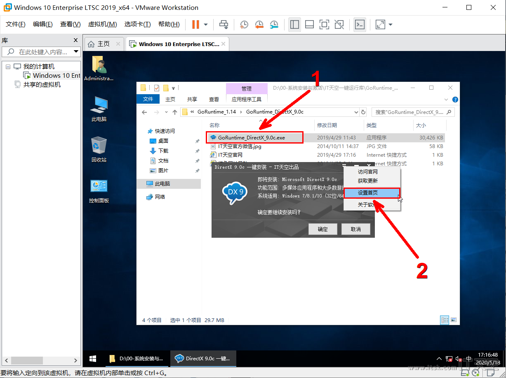
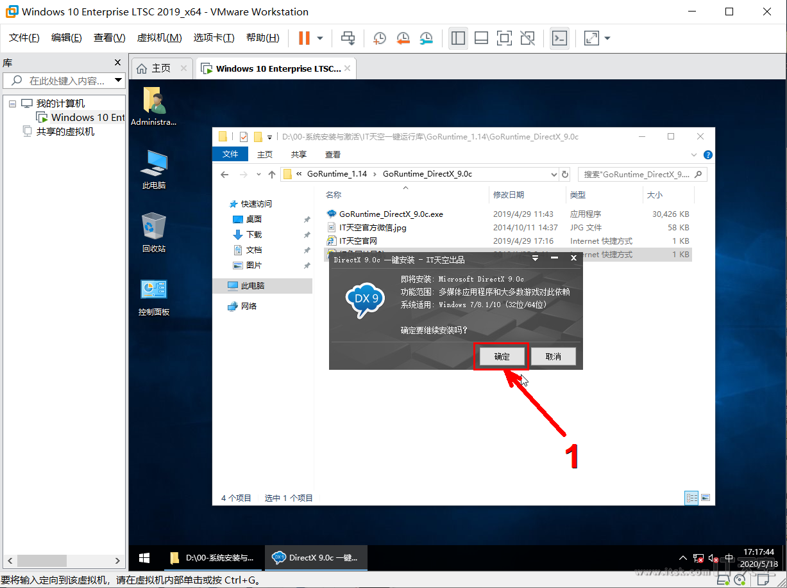
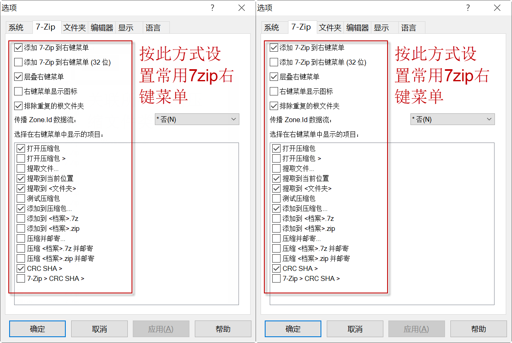
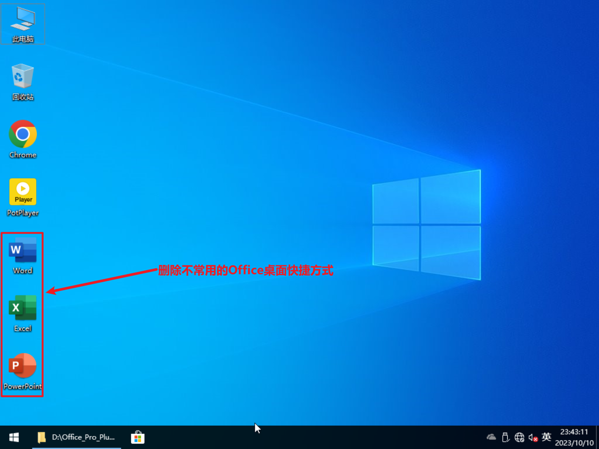

= 常用软件安装及设置
:toc: left
:toc-title: 目录
:toclevels: 4

== 安装运行库组件
=== 安装IT天空一键运行库的link:https://www.itsk.com/thread-396895-1-1.html[GoRuntime_DirectX_9.0c运行库]
只需要安装link:https://www.itsk.com/thread-396895-1-1.html[GoRuntime_DirectX_9.0c运行库], 微软常用运行库更新较慢, 使用果壳剥壳下载的最新微软常用运行库合集替换.
安装程序里有首页绑定, 在设置里取消设置首页选项的勾选解除绑定.

=== 安装link:https://www.ghxi.com/yxkhj.html[微软常用运行库合集]
打开link:https://www.ghxi.com/yxkhj.html[微软常用运行库合集]安装包后, 依次点击下一步即可完成安装.
image:images/运行库安装1.png[align=center]
image:images/运行库安装2.png[align=center]
image:images/运行库安装3.png[align=center]
image:images/运行库安装4.png[align=center]

## 安装link:https://www.7-zip.org/[7zip]
打开link:https://www.7-zip.org/[7zip]安装包, 依次点击下一步即可完成安装. 并按照下面步骤设置link:https://www.7-zip.org/[7zip]:

== 安装link:https://www.yrxitong.com/h-nd-1030.html[Office2021]
. 打开离线link:https://www.yrxitong.com/h-nd-1030.html[Office2021]安装包后, 选择相应组件(通常选择word/excel/powerpoint)一键安装.
. 把桌面不常用用到的office快捷方式给删除.

## 拍摄快照备份
TIP: 常用软件目前只安装更新频率慢且经常用的, 其他应用如QQ/微信/迅雷等非必须且更新迭代很快的软件不建议安装, 此类应用建议直接下载绿色免安装版.

最后, 在进行下一个阶段前, 记得做一次快照备份.
image:images/常用软件安装后.webp[align=center]