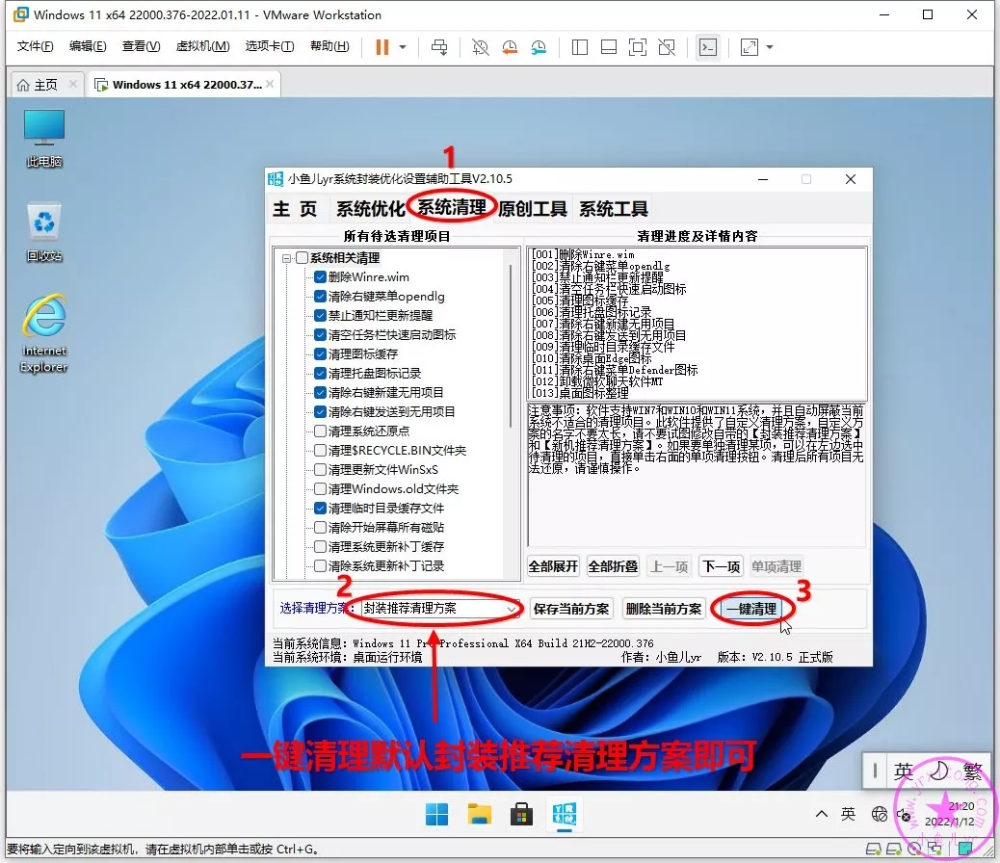
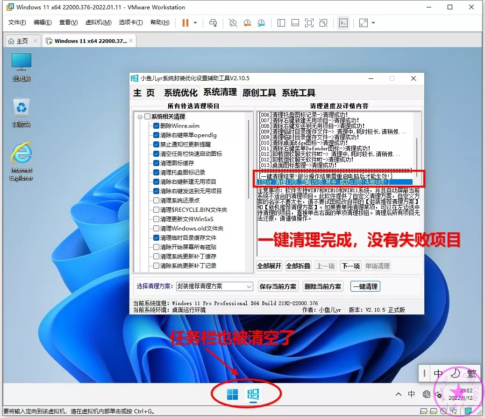
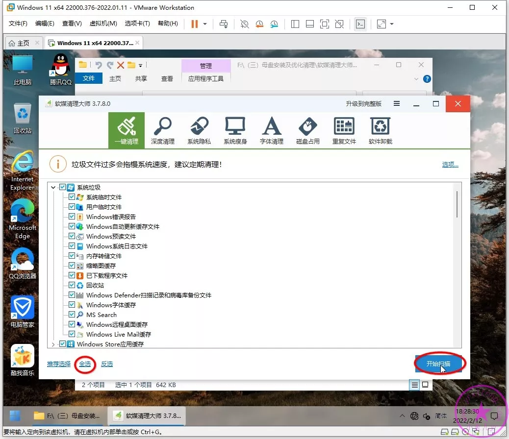
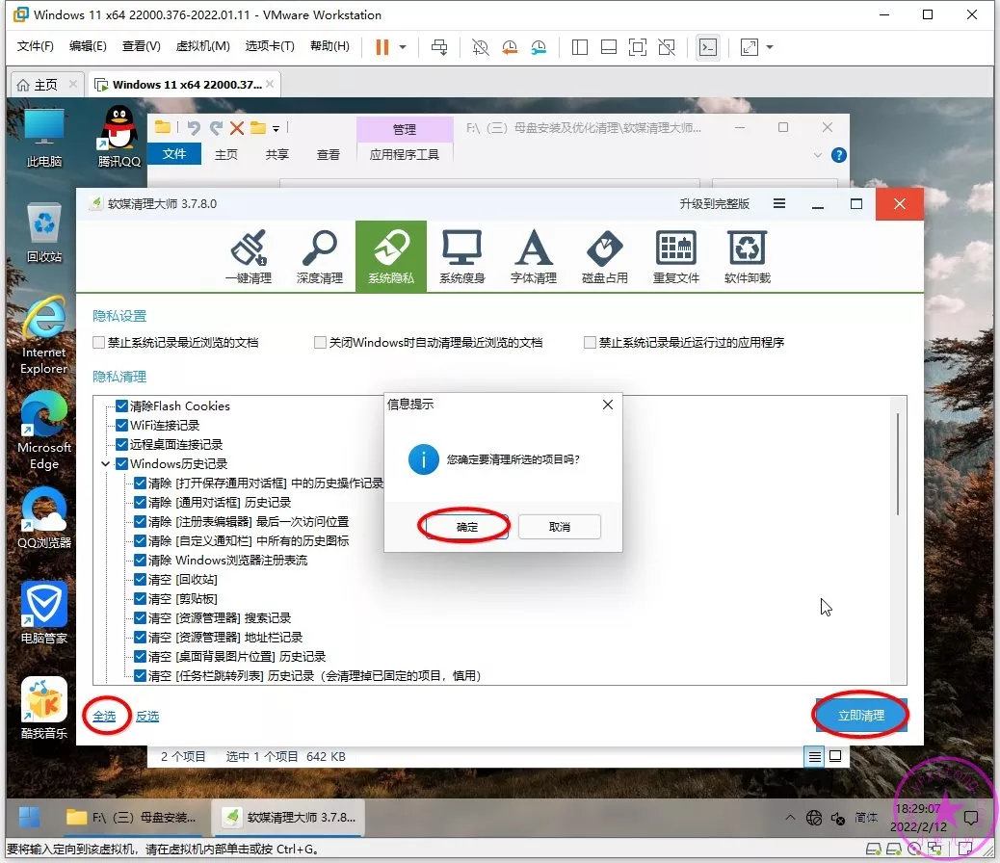
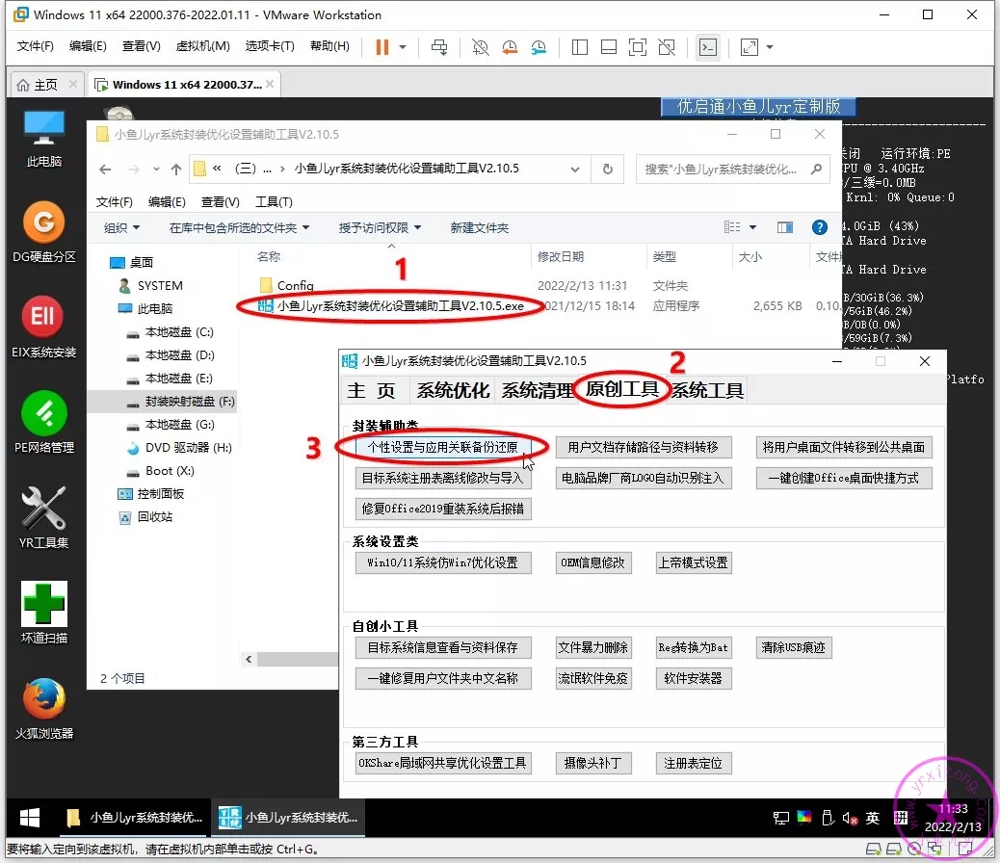
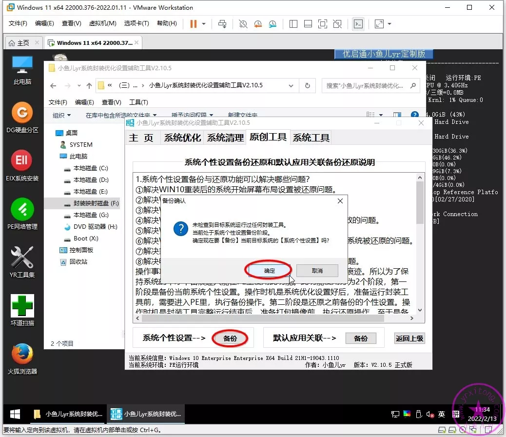
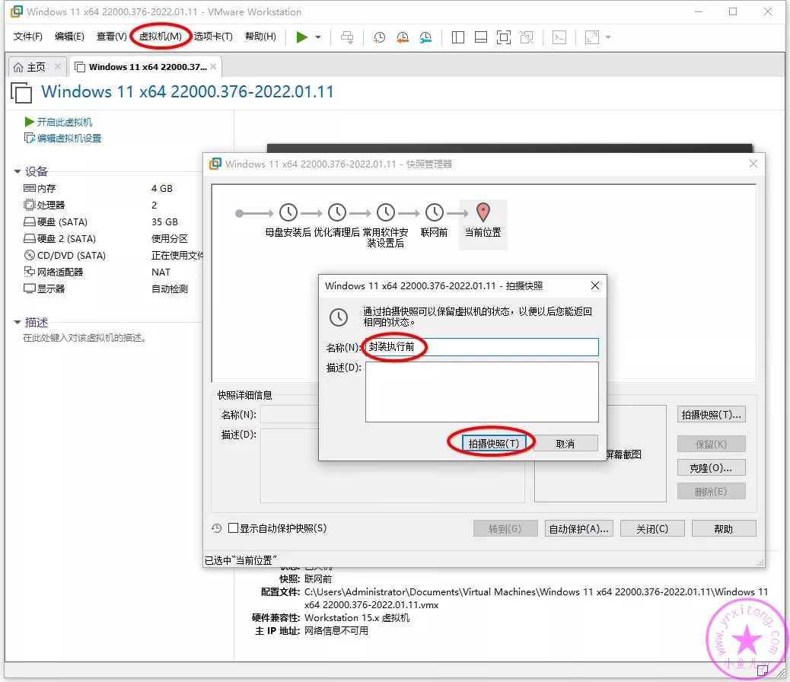

= 使用工具优化和封装前清理
:toc: left
:toc-title: 目录
:toclevels: 4

== 封装前全面清理
=== 清理部分
打开link:https://www.yrxitong.com/h-nd-100.html[小鱼儿yr系统封装优化设置辅助工具]，按照下图步骤继续用辅助工具进行一键清理。

=== 使用Dism++清理
按照下图步骤继续用Dism++进行清理。

image:images/dism++空间回收.webp[align=center]

=== 使用软媒清理大师清理
软媒也是一款比较经典的老款优化清理软件，其优化部分我们也不用设置了，辅助工具已经代替它帮我们优化过系统了，我们就用它清理一下就行了。只选择一键清理和系统隐私进行清理即可。

=== 备份系统个性设置
重启系统进入PE系统，按照下图操作进行系统个性备份。

=== 封装前拍摄快照

