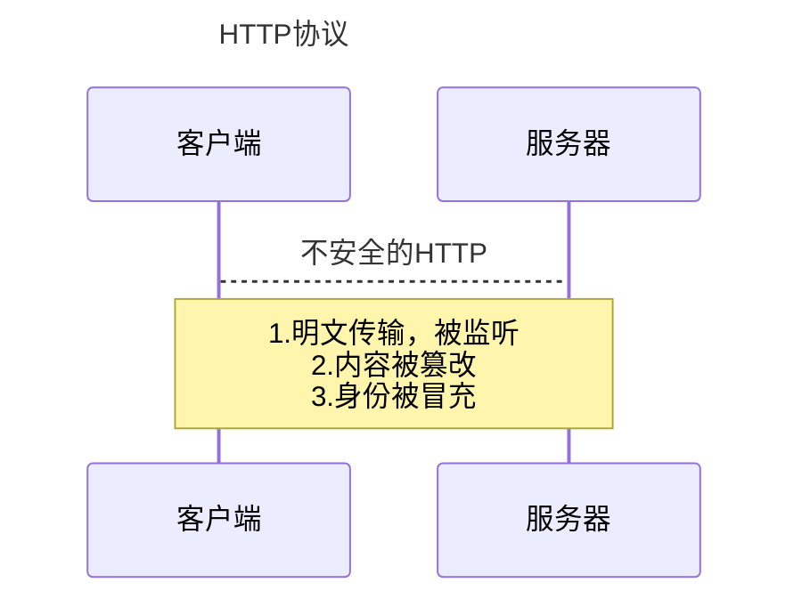
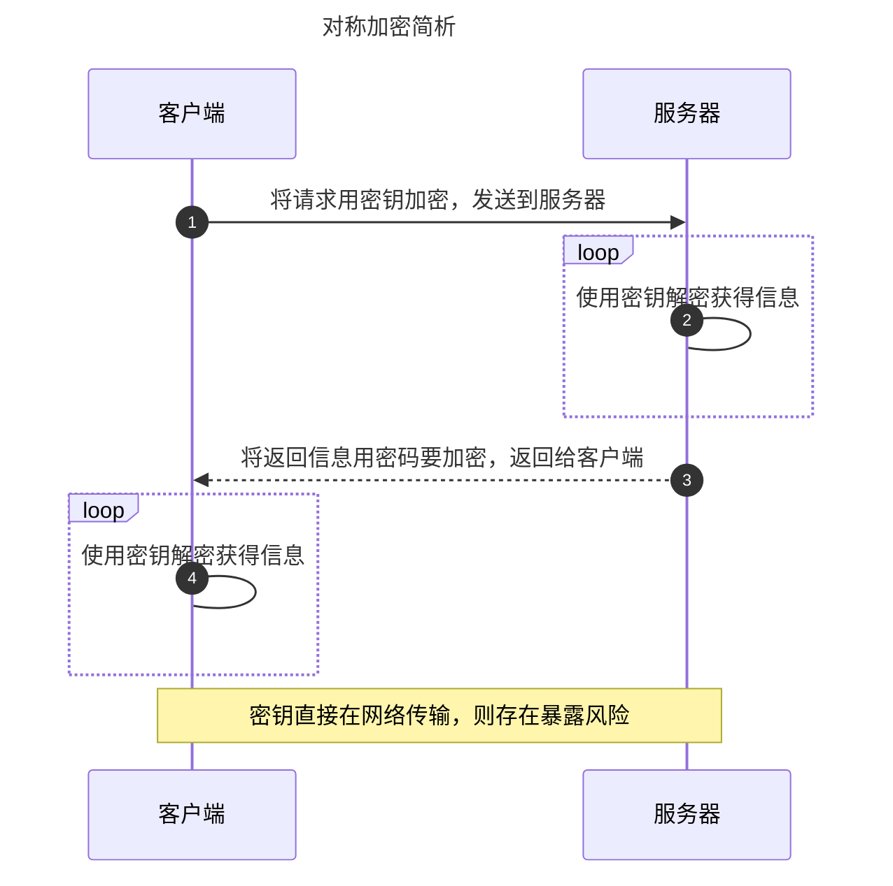
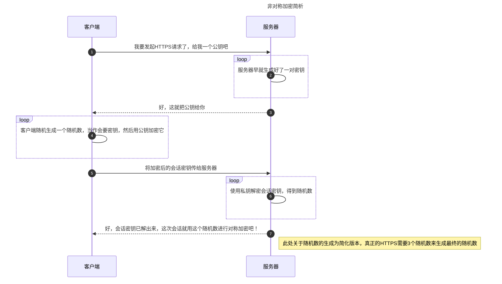
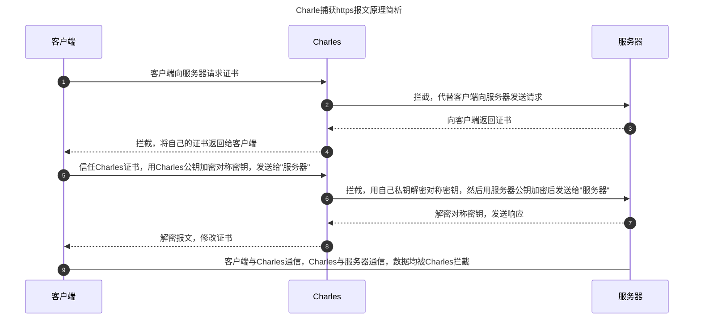

# CharlesProxy 原理简析

[CharlesProxy][1]官网介绍如下：

> [CharlesProxy][1]是 HTTP 代理/ HTTP 监视器/反向代理，使开发人员可以查看其计算机与 Internet 之间的所有 HTTP 和 SSL / HTTPS 通信。 这包括请求，响应和 HTTP 标头（其中包含 cookies 和缓存信息）。

## 正向代理（forward proxy）

## 反向代理（reverse proxy）

## Charles 捕获 HTTPS 报文原理

| 对比     | 对称加密                                       | 非对称加密                                         |
| -------- | ---------------------------------------------- | -------------------------------------------------- |
| 特点     | 只有一个唯一的密钥                             | 有一对公钥和私钥                                   |
| 优点     | 速度快                                         | 公钥是公开的，私钥是不公开的，只要私钥不泄露就没事 |
| 缺点     | 每人手上都有个相同的密钥，任意一方泄露全体完蛋 | 速度慢                                             |
| 例子     | DES                                            | RSA                                                |
| 数学原理 | 异或运算                                       | 大整数因数分解                                     |

> [CharlesProxy][1]的本质就是劫持。但是之所以能够劫持，并不是因为 https 不安全，而是因为操作人主动安装信任了[CharlesProxy][1]证书。

## 参考文档

- https://github.com/youngwind/blog/issues/108
- https://www.jianshu.com/p/405f9d76f8c4

[1]: https://www.charlesproxy.com/
